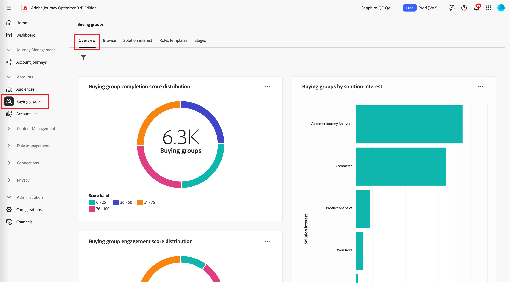
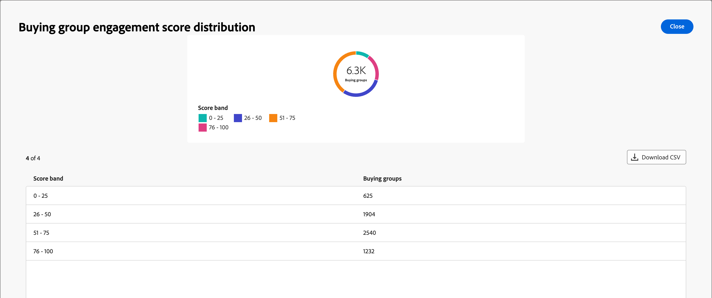

# Instrumentpanel för översikt över inköpsgrupper

Kontrollpanelen Översikt för inköpsgrupper är utformad för B2B-försäljningsprocessen. Marknadsföringsteamet kan dela _klara_ inköpsgrupper och deras medlemmar tillsammans med viktiga data till säljteamet för utförande. Denna process säkerställer en smidig övergång från marknadsföring till försäljning.

Försäljningen omfattar följande:

* **Dataöverföring**: Marknadsföring identifierar _ready_-måldata och gör den tillgänglig för Försäljning i CSV-format. 
* **Försäljningsgodkännande**: Försäljningen granskar manuellt och inkluderar _klara_ mål i sin pipeline.

Om du vill komma åt den här instrumentpanelen expanderar du **[!UICONTROL Accounts]** i den vänstra navigeringen och väljer sedan **[!UICONTROL Buying groups]**. Välj fliken **[!UICONTROL Overview]** om den inte visas som standard.

{width="800" zoomable="yes"}
<!--
## Buying Group Status

Gain insights into your buying groups' progression with the Buying Group Status view. This visualization showcases the distribution of your buying groups categorized by their most recent status update within a specified time frame.

{width="800" zoomable="yes"}

**[!UICONTROL Status]** (y-axis): Track the journey of buying groups through various stages.
**[!UICONTROL Number of Buying Groups]** (x-axis): Quantify the number of buying groups at each status, providing a clear metric of your funnel's health and activity.

To generate a shareable PDF of your current view, click **[!UICONTROL Export]** at the top-right corner of the page. -->

## Köpa poängfördelning för gruppslutförande

Denna visualisering illustrerar fördelningen av inköpsgrupper baserat på poängen och är indelad i fyra olika poängband. Den centrala siffran representerar det totala antalet inköpsgrupper och ger en snabb bild av den övergripande utvecklingen. De segmenterade färgerna visar andelen inköpsgrupper inom varje poängintervall, vilket gör att du snabbt kan bedöma slutförandetrender.

Om du vill visa mer detaljerad information klickar du på menyikonen **..** längst upp till höger.

{width="500"}

## Köpa fördelning av poäng för gruppengagemang

Denna visualisering illustrerar fördelningen av inköpsgrupper baserat på deras engagemangspoäng och är indelad i fyra distinkta poängband. Den centrala siffran representerar det totala antalet inköpsgrupper och ger en snabb bild av den övergripande utvecklingen. De segmenterade färgerna visar andelen inköpsgrupper inom varje poängintervall, vilket gör att du snabbt kan bedöma slutförandetrender.

Om du vill visa mer detaljerad information klickar du på menyikonen **..** längst upp till höger.

{width="500"}

## Köpa grupper efter lösningsintresse

Denna visualisering illustrerar distributionen av inköpsgrupper efter lösningsintresse och hjälper er att identifiera vilka lösningar som genererar störst intresse. Varje stapel representerar en specifik lösning, där längden anger antalet inköpsgrupper som är kopplade till den aktuella räntan. Stapeldiagrammet ger en tydlig och direkt förståelse för hur efterfrågan på lösningar utvecklas.

Om du vill visa mer detaljerad information klickar du på menyikonen **..** längst upp till höger. Välj **Granska genom** eller **Visa mer**.

{width="500"}

## Filtrera data

Klicka på ikonen _Filter_ (  ) längst upp till vänster om du vill filtrera de data som visas med något av dessa attribut:

* Aktuell fas
* Bransch
* Län
* Intresse av lösningar

{width="500"}

Välj så många värden för varje attribut som du vill använda för att filtrera data och klicka på **[!UICONTROL Apply]**.

## Engagera med data

Använd menyn _Mer_ (**..**) längst upp till höger i varje diagram för att interagera med data.

### [!UICONTROL Drill through]

Välj **[!UICONTROL Drill through]** om du vill ha en ingående analys av enskilda grupppoäng eller gruppfördelningar.

{width="700" zoomable="yes"}

De globala filter som används på kontrollpanelen överförs. Klicka på ikonen _Filter_ (  ) längst upp till vänster för att [ändra attributfiltren](#filter-the-data) för den detaljerade vyn.

Du kan klicka på menyn _Mer_ (**..**) längst upp till höger och välja **[!UICONTROL View more]** för att [visa utökade data](#view-more).

### [!UICONTROL View more]

Välj **[!UICONTROL View more]** om du vill visa utökade data och insikter.

{width="700" zoomable="yes"}

Popup-fönstret som visas innehåller ett diagram och en tabell som visar fördelningen av inköpsgruppsfördelningen.

Om du vill hämta data klickar du på **[!UICONTROL Download CSV]** längst upp till höger i datatabellen. Klicka på **[!UICONTROL Close]** om du vill återgå till översiktspanelen.
