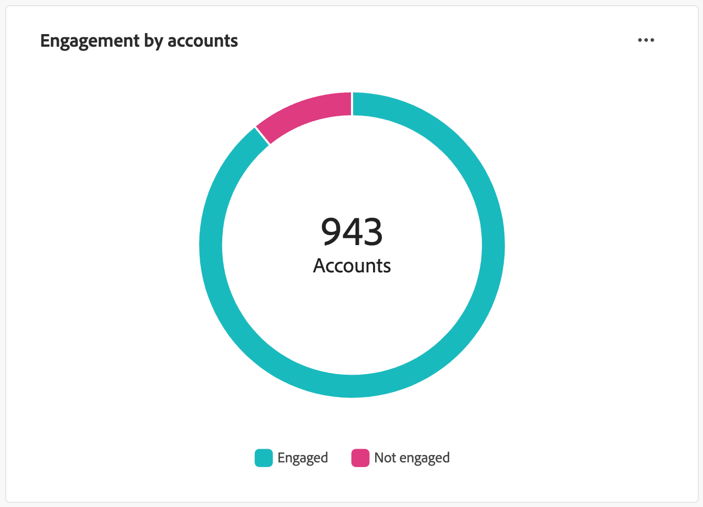

# Instrumentpanel för Åtagandeöversikt

Den här instrumentpanelen ger en heltäckande bild av engagemanget och visar realtidsstatistik över konton och individuella interaktioner via snapshot-donsdiagram och trendavslöjande linjediagram över tiden. Det hjälper er att övervaka och strategiska era engagemangsinsatser effektivt.

Om du vill komma åt _Åhörandekontrollpanelen_ markerar du **[!UICONTROL Dashboard]**-objektet i den vänstra navigeringen. Välj sedan fliken **[!UICONTROL Engagement]** överst på sidan.

<!-- To generate a shareable PDF of your current view, click **[!UICONTROL Export]** at the top-right corner of the page. To engage with the data, use the action menu in the top-right corner. -->

{width="800" zoomable="yes"}

## Engagemang per konto/inköpsgrupp/personer

Cirkeldiagrammen delar upp konton, inköpsgrupper eller personer i både engagerade och icke-engagerade kategorier. Den centrala siffran visar det totala antalet inom varje kategori, vilket ger en överblick över det övergripande engagemanget.

{width="500"}

## Konton/inköpsgrupper/personer som varit engagerade över tid

Dessa linjediagram visar hur många konton eller personer som är engagerade över tid. Med tydliga linjer för&quot;Engaged&quot; och&quot;Not Engaged&quot;, som visualiseras tillsammans med en tidsstämplad horisontell axel, kan du identifiera trender och mönster. Du kan hovra över en rad för att visa exakta mått för ett visst datum.

{width="500"}

## Filtrera data

Du kan filtrera de data som visas efter datumintervall och attribut.

### Datumintervallfilter

Använd _[!UICONTROL Date range filter]_&#x200B;längst upp till höger för att filtrera data efter datumintervallet.

{width="380"}

För intervallet **[!UICONTROL Custom]** kan du använda kalenderverktyget för att ange start- och slutdatum. Slutdatumet är som standard den aktuella dagen.

{width="380"}

### Attributfilter

Klicka på ikonen _Filter_ (  ) längst upp till vänster om du vill filtrera de data som visas med något av dessa attribut:

* Intresse av lösningar
* Typ av åtagande
* Län
* Bransch
* Köper gruppmedlemsroll

{width="500"}

Välj så många värden för varje attribut som du vill använda för att filtrera data och klicka på **[!UICONTROL Apply]**.

## Engagera med data

Använd menyn **..** längst upp till höger i varje diagram för att interagera med data.

{width="300"}

### Detaljgranska

För ett cirkeldiagram väljer du **[!UICONTROL Drill through]** för en ingående analys av enskilda gruppinteraktionsdata.

De globala filtren (dataområde och attribut) tillämpas på kontrollpanelen. Klicka på ikonen _Filter_ (  ) längst upp till vänster för att [ändra attributfiltren](#filter-the-data) för den detaljerade vyn. Använd datumintervallväljaren längst upp till höger för att [ändra datumintervallet](#date-range-filter) för detaljvyn.

{width="700" zoomable="yes"}

| Engagemang per konto | Engagemang genom inköpsgrupper | Engagemang av människor |
| ---------------------- | --------------------------- | -------------------- |
| <li>Kontonamn <li>Status <li>Personer engagerade (tal)<li>Förlovningsaktiviteter (antal) <li>Senaste åtagande (datum) | <li>Köpgrupp <li>Konto <li>Intresse av lösningar <li>Status <li>Förlovningsaktiviteter (antal) | <li>Namn <li>Status <li>E-post (adress) <li>Förlovningsaktiviteter (antal) <li>Senaste engagemang (datum) |

Du kan klicka på menyikonen **..** längst upp till höger och välja **[!UICONTROL View more]** för att [visa utökade data och insikter](#view-more).

### Visa mer

Välj **[!UICONTROL View more]** om du vill ha utökade data och insikter.

{width="700" zoomable="yes"}

Beroende på diagrammet finns det utökade data för följande:

| Engagemang per konto/inköpsgrupper/personer | Konton/inköpsgrupper/personer som har varit engagerade över tid |
| ----------------------------------------------- | -------------------------------------------------- | 
| <li>Engagerad <li>Inte engagerad | <li>Datum <li>Konton / Köpgrupper / Personer (tal) <li>Engagerad/ej engagerad |

Om du vill kopiera utökade data klickar du på **[!UICONTROL Download CSV]** överst till höger.
