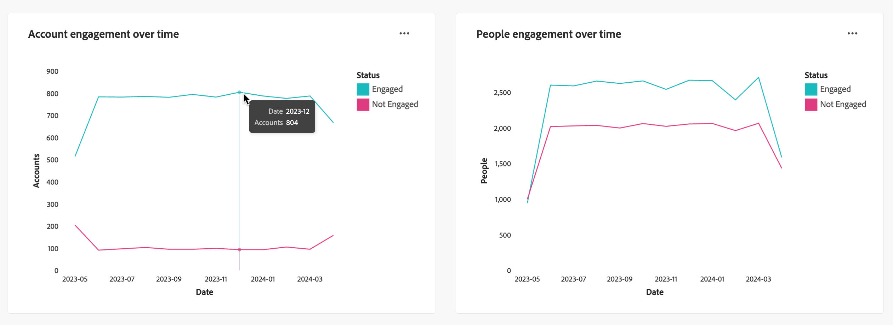

# Instrumentpanel för Åtagandeöversikt

Den här instrumentpanelen ger en heltäckande bild av engagemanget och visar realtidsstatistik över konton och individuella interaktioner via snapshot-donsdiagram och trendavslöjande linjediagram över tiden. Det hjälper er att övervaka och strategiska era engagemangsinsatser effektivt.

<!-- To generate a shareable PDF of your current view, click **[!UICONTROL Export]** at the top-right corner of the page. To engage with the data, use the action menu in the top-right corner. -->

## Engagemang per konton/personer

Nedbrytningskartorna delar upp konton eller människor i kategorier som är både engagerade och icke-engagerade. Den centrala siffran anger det totala antalet inom varje kategori, vilket ger en överblick över det övergripande engagemanget.

{width="700" zoomable="yes"}

## Engagemang per konton/personer över tid

Dessa linjediagram visar hur många konton eller personer som är engagerade över tid. Med tydliga linjer för&quot;Engaged&quot; och&quot;Not Engaged&quot;, som visualiseras tillsammans med en tidsstämplad horisontell axel, kan du identifiera trender och mönster. Du kan hovra över en rad för att visa exakta mått för ett visst datum.

{width="700" zoomable="yes"}

## Förbättrade interaktioner

Engagera dig ytterligare med data genom att använda åtgärdsikonen ( **...** ) i det övre högra hörnet.

{width="400"}

### Visa mer

**[!UICONTROL View More]**: För alla instrumentpanelsvyer visas ett popup-fönster med diagrammet och en tabell som visar hur engagemanget är fördelat på konto/personer.

Hämta CSV-knappen i tabellens övre högra hörn.
<!-- 
### Drill through

Choose **[!UICONTROL Drill through]** for an in-depth analysis of individual group statuses.

The global filters applied to the dashboard are carried over to this page.

The applied filters are displayed, but are not editable on this page. 
The only available filters that are enabled are _Account Name_ or _Person Name_.

To display or hide available columns, click **[!UICONTROL View more]** at the top-right corner:

Click **[!UICONTROL View more]** to open the download dialog.

Button on the top right corner to open a pop-up with the available column list:

* [!UICONTROL Account]
* [!UICONTROL Account name]
* [!UICONTROL Account ID]
* [!UICONTROL Status]
* [!UICONTROL People engaged]
* [!UICONTROL Engagement activities]
* [!UICONTROL Last engagement date]
* [!UICONTROL Region]
* [!UICONTROL Industry]
* [!UICONTROL People]
* [!UICONTROL Name]
* [!UICONTROL Person ID]
* [!UICONTROL Status]
* [!UICONTROL Email]
--->

### Filter

Globalt filter: **[!UICONTROL Date]**, som återspeglar senaste ändringsdatum för inköpsgrupp. Startdatumet kan justeras. Slutdatumet är som standard den aktuella dagen.

Du kan även filtrera visningen med något av följande attribut:

* Intresse av lösningar
* Lista över lösningsintressen
* Typ av engagemang
* Lista över engagemangstyper
* Kontoregion
* Kontots region
* Kontobransch
* Kontots bransch
