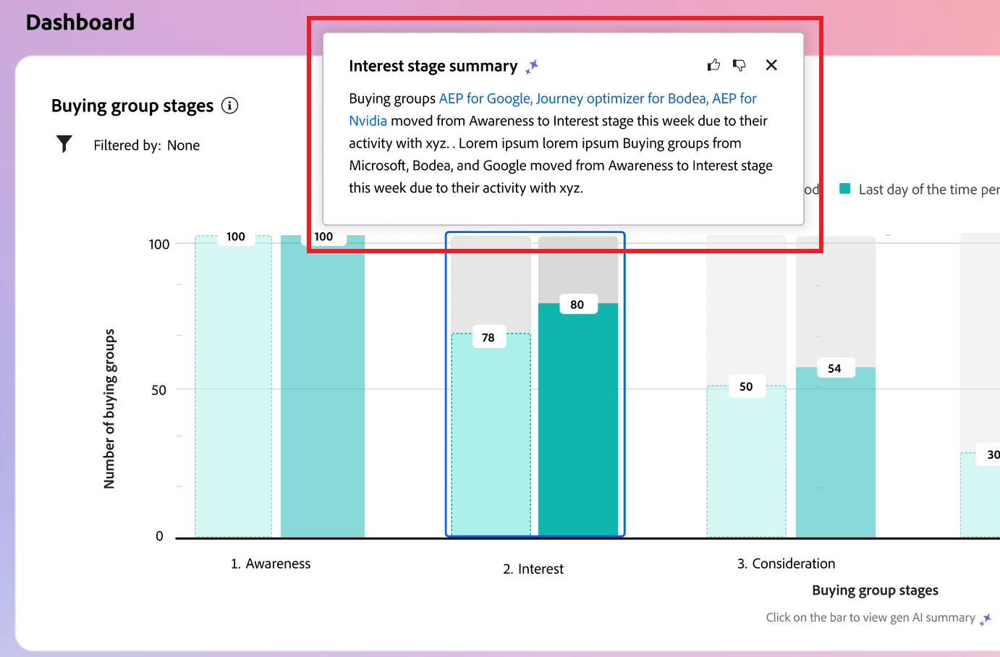

# Intelligent Dashboard

Den intelligenta Dashboard ger en heltäckande bild av kundgruppens och kontots mätvärden, vilket hjälper er att övervaka och strategiska era marknadsföringssatsningar mer effektivt.

Om du vill komma åt _Intelligent Dashboard_ markerar du **[!UICONTROL Dashboard]**-objektet i den vänstra navigeringen.

{width="800" zoomable="yes"}

Den intelligenta kontrollpanelen ger även åtkomst till konto- och köpgruppsinformationssidor som innehåller två typer av generativa AI-funktioner:

* Sammanfattningar för konton och inköpsgrupper
* Avsiktsidentifiering för person, inköpsgrupp och konto

{{intent-data-note}}

## Köpgruppsfaser {#buying-group-stages}

>[!CONTEXTUALHELP]
>id="ajo-b2b_intelligent_dashboard_buying_group_stages"
>title="Köpgruppsfaser"
>abstract="I det här diagrammet visas en översikt över hur inköpsgrupper fortskrider i olika faser baserat på de konfigurerade övergångsreglerna. I det första fältet visas antalet inköpsgrupper i ett specifikt skede på det första datumet i den valda tidsramen jämfört med antalet inköpsgrupper på det sista datumet i den valda tidsramen."

Diagrammet _[!UICONTROL Buying Group Stages]_ger en översikt över hur inköpsgrupper fortskrider i olika faser ([baserat på övergångsregler som har konfigurerats av en administratör](../buying-groups/buying-group-stages.md)).

{width="800" zoomable="yes"}

I diagrammet används inköpsgruppfaserna från den senast publicerade versionen av inköpsgruppens fasmodell. Varje steg reflekteras av två staplar. Den första raden visar antalet inköpsgrupper på det första datumet i den valda tidsramen. Och det andra (i jämförelse) är antalet inköpsgrupper på det sista datumet i tidsramen. Du kan hålla muspekaren över varje fält för att se antalet inköpsgrupper i varje fas.

{width="400"}

### Generativ AI-sammanfattning

Klicka på ett fält för att visa en generativ AI-sammanfattning av inköpsgrupper i det steget för den valda tidsperioden.

{width="500"}

Den genererade sammanfattningen ger en översikt över hur inköpsgrupper fortskrider i olika faser baserat på de konfigurerade övergångsreglerna.

### Tidsperiod {#time-period-stages}

Använd datumfiltret längst upp till höger för att ändra datumintervallet för datavisualiseringar. Klicka på nedåtpilen för att ange ett relativt datumintervall eller för att ange anpassade start- och slutdatum.

<!-- {width="300"} -->

### Attributfilter {#attribute-filter-stages}

Klicka på ikonen _Filter_ (  ) längst upp till vänster om du vill filtrera datavisningen med något av dessa attribut:

* Intresse av lösningar
* Konto
* Scennamn

<!-- Add screen when the UI is available {width="500"} -->

## Köpgrupper i korthet {#buying-group-highlights}

>[!CONTEXTUALHELP]
>id="ajo-b2b_intelligent_dashboard_buying_group_highlights_engagement"
>title="De fem populäraste inköpsgrupperna efter engagemang"
>abstract="De mest engagerade inköpsgrupperna baserat på deras normaliserade engagemangspoäng."

>[!CONTEXTUALHELP]
>id="ajo-b2b_intelligent_dashboard_buying_group_highlights_velocity"
>title="De fem snabbaste köpgrupperna"
>abstract="Köpgrupper baserat på hur snabbt de utvecklas stegvis."

>[!CONTEXTUALHELP]
>id="ajo-b2b_intelligent_dashboard_buying_group_highlights_stagnant"
>title="De fem viktigaste köpgrupperna"
>abstract="Fantastiska inköpsgrupper som inte går igenom alla faser trots höga slutresultat."

Avsnittet _[!UICONTROL Buying group highlights]_är organiserat i tre rader för att visa information om inköpsgrupper av intresse för din organisation.

{width="800" zoomable="yes"}

* **De fem populäraste inköpsgrupperna efter engagemang** - Den här raden visar de högst engagerade inköpsgrupperna baserat på deras normaliserade engagemangspoäng.
* **De fem populäraste köpgrupperna med hög hastighet** - På den här raden visas de främsta köpgrupperna baserat på hur snabbt de går igenom inköpsgruppsfaserna.
* **De fem populäraste mellanliggande inköpsgrupperna** - Den här raden visar de mest mellanliggande inköpsgrupperna som inte går igenom faser trots ett högt slutresultat.

Varje kort innehåller följande data:

* **_Buying group name_**. Klicka på namnet för att öppna sidan med information om inköpsgrupper.
* **_Kontonamn_**. Klicka på namnet för att öppna kontodetaljsidan (hyperlänkad till kontodetaljsidan).
* **_Aktuell fas_** för inköpsgruppen.
* **_Aktivitetspoäng_** (normaliserat för alla inköpsgrupper). Om alla inköpsgrupper har samma högsta poäng visas den senaste uppdaterade poängen.
* **_Slutförandepoäng_** (från 1-100). Om alla inköpsgrupper har samma högsta poäng visas den senaste uppdaterade poängen.
* **_Kategoriåtergivning_**. Klicka på _[!UICONTROL View details]_för att visa återgivningsdata:

  {width="500" zoomable="yes"}

   * I informationsfönstret visas kategorinamnet med återgivningsnivån högst upp.
   * Data för varje rad är ordnade i kolumner: produktnamn, produktintent-styrka och nyckelord högst upp efter intent-strength.
   * Sorteringsordningen är hög till låg för kategori, produkt och nyckelord. Om en eller flera av typerna har samma återgivningsstyrka används alfabetisk ordning i sorteringen.

Klicka på **[!UICONTROL View All]** längst upp till höger på panelen _Om du vill köpa en grupp markeras_ klickar du på  för att navigera till listsidan för köpgrupper.

### Attributfilter {#attribute-filter-bg-highlights}

Klicka på ikonen _Filter_ (  ) längst upp till vänster om du vill filtrera datavisningen med något av dessa attribut:

* Intresse av lösningar
* Köpgrupp
* Konto

<!-- Add screen when the UI is available {width="500"} -->

### Tidsperiod {#time-period-bg-highlights}

Använd datumfiltret längst upp till höger för att ändra datumintervallet för datavisualiseringar. Klicka på nedåtpilen för att ange ett relativt datumintervall eller för att ange anpassade start- och slutdatum.

<!-- {width="300"} -->

## Efterföljande konton {#account-surge}

>[!CONTEXTUALHELP]
>id="ajo-b2b_intelligent_dashboard_account_surge"
>title="Kontoökning"
>abstract="Konton med stor förändring i engagemanget inom den valda tidsramen."

Avsnittet _[!UICONTROL Surging accounts]_visar en visualisering av kontona med en betydande förändring i engagemanget inom den valda tidsramen.

{width="800" zoomable="yes"}

Håll pekaren över varje fält för att visa antalet konton i varje kategori.

{width="400"}

Klicka på ett fält för att visa en generativ AI-sammanfattning av kontona i kategorin för den valda tidsramen.

{width="500"}

### Attributfilter {#attribute-filter-acct-surge}

Klicka på ikonen _Filter_ (  ) längst upp till vänster om du vill filtrera datavisningen med något av dessa attribut:

* Intresse av lösningar
* Bransch
* Län

<!-- Add screen when the UI is available {width="500"} -->

### Tidsperiod {#time-period-acct-surge}

Använd datumfiltret längst upp till höger för att ändra datumintervallet för datavisualiseringar. Klicka på nedåtpilen för att ange ett relativt datumintervall eller för att ange anpassade start- och slutdatum.

<!-- {width="300"} -->

## Kontohögdagrar {#account-highlights}

>[!CONTEXTUALHELP]
>id="ajo-b2b_intelligent_dashboard_account_highlights_surging"
>title="Efterföljande konton"
>abstract="Konton med avsevärt ökat engagemang i den valda tidsramen "

>[!CONTEXTUALHELP]
>id="ajo-b2b_intelligent_dashboard_account_highlights_at_risk"
>title="Riskkonton"
>abstract="Konton med en avsevärd minskning av engagemangets drivkraft under den valda tidsramen."

Avsnittet _[!UICONTROL Buying group highlights]_är indelat i två rader för att visa information om konton av intresse för din organisation.

{width="800" zoomable="yes"}

* **Övergående konton** - Den här raden visar kontona med en betydande ökning av engagemanget under den valda tidsramen.
* **Riskkonton** - Den här raden visar kontona med en betydande minskning av engagemanget under den valda tidsramen.

Varje kort innehåller följande data:

* **_Kontonamn_**. Klicka på namnet för att öppna sidan med kontoinformation.
* **_Generativ AI-sammanfattning_** av kontot.
* **_Nyckelordsmetod_**. Klicka på _[!UICONTROL View details]_för att visa återgivningsdata:

  {width="500" zoomable="yes"}

   * I informationsfönstret visas kategorinamnet med återgivningsnivån högst upp.
   * Data för varje rad är ordnade i kolumner: produktnamn, produktintent-styrka och nyckelord högst upp efter intent-strength.
   * Sorteringsordningen är hög till låg för kategori, produkt och nyckelord. Om en eller flera av typerna har samma återgivningsstyrka används alfabetisk ordning i sorteringen.
<!-- 
At the top right of the _Buying group highlights_ panel, click **[!UICONTROL View All]** to navigate to the Buying groups list page. -->

### Attributfilter {#attribute-filter-acct-highlights}

Klicka på ikonen _Filter_ (  ) längst upp till vänster om du vill filtrera datavisningen med något av dessa attribut:

* Intresse av lösningar
* Köpgrupp

<!-- Add screen when the UI is available {width="500"} -->

### Tidsperiod {#time-period-acct-highlights}

Använd datumfiltret längst upp till höger för att ändra datumintervallet för datavisualiseringar. Klicka på nedåtpilen för att ange ett relativt datumintervall eller för att ange anpassade start- och slutdatum.

<!-- {width="300"} -->

## Kontakttäckning {#contact-coverage}

>[!CONTEXTUALHELP]
>id="ajo-b2b_intelligent_dashboard_contact_coverage"
>title="Kontakttäckning"
>abstract="Visar antalet kontakter med en specifik roll som är associerad med ett lösningsintresse. Tilldelningen av roll- och lösningsintressen baseras på köpgruppsmallen."

Avsnittet _[!UICONTROL Contact coverage]_visar en visualisering av antalet kontakter med en specifik roll som är associerad med ett lösningsintresse. Tilldelningen av roll- och lösningsintressen baseras på köpgruppsmallen.

{width="800" zoomable="yes"}

Håll pekaren över varje cell för att visa antalet kontakter i rollen/lösningsintresset.

{width="400"}

Klicka på en cell för att visa detaljerad information om kontakterna i rollen/lösningsintresset.

{width="700" zoomable="yes"}

### Attributfilter {#attribute-filter-contact-coverage}

Klicka på ikonen _Filter_ (  ) längst upp till vänster om du vill filtrera datavisningen med något av dessa attribut:

* Intresse av lösningar
* Konton

<!-- Add screen when the UI is available {width="500"} -->

## Kontaktöverlappning {#contact-overlap}

>[!CONTEXTUALHELP]
>id="ajo-b2b_intelligent_dashboard_contact_overlap"
>title="Kontaktöverlappning"
>abstract="Lista över kontakter som ingår i mer än en inköpsgrupp som ett resultat av att de är kopplade till flera lösningsintressen."

Avsnittet _[!UICONTROL Contact overlap]_visar en lista med kontakter som är en del av mer än en inköpsgrupp som ett resultat av att de är kopplade till flera lösningsintressen.

{width="800" zoomable="yes"}

Klicka på _Informationsikonen_ (  ) om du vill visa en tabell med följande information:

* Köpgruppens namn (klicka på namnet för att öppna sidan med information om inköpsgruppen)
* Roll
* Intresse av lösningar
* Produktåtergivning
* Produkt

{width="600" zoomable="yes"}

### Attributfilter {#attribute-filter-contact-overage}

Klicka på ikonen _Filter_ (  ) längst upp till vänster om du vill filtrera datavisningen med något av dessa attribut:

* Intresse av lösningar
* Roller
* Konton

<!-- Add screen when the UI is available {width="500"} -->
