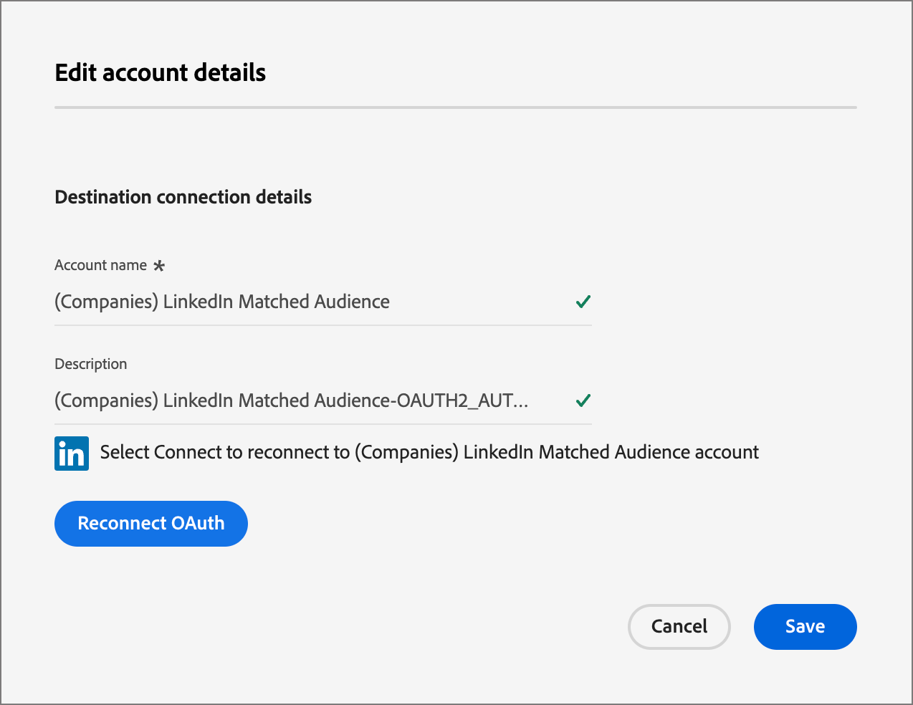

# LinkedIn-konto matchar målgrupper

Journey Optimizer B2B edition kan generera LinkedIn Ad-målgrupper via Account Matched Audiences och är utformat för att hjälpa er att fylla tomma roller i era inköpsgrupper. Genom att definiera en uppsättning inköpsgruppfilter kan du upprätthålla en LinkedIn Matched Audience för att rikta presumtiva kunder som matchar köpgruppsparametrarna. Du kan också aktivera en målgrupp från en kontoresa från en _Ta en åtgärd_-nod.

Den här funktionen utnyttjar Experience Platform Destinations för att hantera vissa aspekter av integreringen. Det finns en gräns på tio dataflöden.

Innan du initierar ett dataflöde från Journey Optimizer B2B edition måste du ha minst en instans av [(Companies) LinkedIn Matched Audience-målkopplingen ](https://experienceleague.adobe.com/en/docs/experience-platform/destinations/catalog/social/linkedin#connect){target="_blank"} med ett LinkedIn Campaign Manager-konto konfigurerat i ditt Experience Platform-program.

## Konfigurera en ny LinkedIn-kontoanslutning {#linkedin-destination-setup}

>[!CONTEXTUALHELP]
>id="ajo-b2b_linkedin_destination_setup"
>title="Inställning av LinkedIn-mål krävs"
>abstract="Skicka konton som filtrerats genom inköpsgrupper till en länkad destination för att kunna interagera med potentiella köpgruppsmedlemmar. Du kan skapa upp till 10 dataflöden för 10 olika grupper med filtrerade konton. Om du vill komma igång med den här funktionen lägger du till ett länkat mål först."

1. I Experience Platform går du till **[!UICONTROL Connections]** > **[!UICONTROL Destinations]** i den vänstra navigeringen och väljer fliken **[!UICONTROL Catalog]**.

1. Leta reda på **[!UICONTROL (Companies) LinkedIn Matched Audience]**-kopplingen i katalogen.

   >[!TIP]
   >
   >Du kan snabbt hitta kopplingen genom att ange `LinkedIn` i sökrutan.

1. Klicka på ikonen _Mer_ (**..**) på kopplingskortet och välj **[!UICONTROL Configure new destination]**.

   {width="800" zoomable="yes"}

1. Markera **[!UICONTROL New Account]** och klicka på **[!UICONTROL Connect to destination]**.

   {width="500"}

1. Ange dina inloggningsuppgifter för LinkedIn och logga in.

   Efter autentiseringen är LinkedIn-kontot anslutet som ett mål i Experience Platform.

   {width="400"}

   >[!IMPORTANT]
   >
   >**skriv inte** _[!UICONTROL Destination details]_. Endast anslutningen behövs.

## Uppdatera kontoinformationen

Namnet och beskrivningen för LinkedIn-kontot visas för inköpsgrupper i Journey Optimizer B2B edition. Det är en god vana att uppdatera denna information så att den är lätt att identifiera för de marknadsförare som arbetar med inköpsgrupper. Du kan ändra kontoinformationen i användargränssnittet för Experience Platform eller Journey Optimizer B2B edition.

1. Gå till **[!UICONTROL Connections]** > **[!UICONTROL Destinations]** i den vänstra navigeringen och välj fliken **[!UICONTROL Accounts]**.

1. Klicka på menyn _Mer_ (**..**) för det nya kontot som du har skapat och välj **[!UICONTROL Edit details]**.

   {width="800" zoomable="yes"}

1. Uppdatera namn och beskrivning i dialogrutan.

   {width="500"}

1. Klicka på **[!UICONTROL Save]**.

## Aktivera kontot för inköpsgrupper

>[!NOTE]
>
>Om du redan har tio dataflöden kan du inte skapa ytterligare. Om du har nått maxgränsen tar du bort en i Experience Platform innan du skapar en ny i Journey Optimizer B2B edition.

1. I Journey Optimizer B2B edition går du till **[!UICONTROL Accounts]** > **[!UICONTROL Buying groups]** i den vänstra navigeringen.

1. Klicka på fliken **[!UICONTROL Browse]**.  

1. Klicka på **[!UICONTROL Activate to LinkedIn Destination]** överst till höger.

   {width="800" zoomable="yes"}

1. Ge dataflödet ett beskrivande namn och en beskrivning (valfritt).

   När du har sparat det läggs det namn du anger för dataflödet till _AJOB2B_ som hjälp när du identifierar dataflödet i Experience Platform.

1. Ange [konto-ID:t för ditt LinkedIn Campaign Manager-konto](https://www.linkedin.com/help/lms/answer/a424270).

   Du kan hitta ditt konto-ID med ditt kontonamn i gränssnittet för Campaign Manager.

   {width="700" zoomable="yes"}

1. Klicka på **[!UICONTROL Select buying group filters]** och definiera parametrarna för din kontopublik.

   >[!IMPORTANT]
   >
   >För närvarande går det inte att redigera filter efter att dataflödet har aktiverats. Dubbelkontrollera arbetet innan du aktiverar dataflödet.

   {width="400"}

   För **[!UICONTROL Engagement score]** är operatorn `Between` inkluderande, liksom procentintervall. 5.1 och 5 är till exempel både _mellan_ 5 och 6.

   Tomma villkor behandlas som `Is Any`.

   Klicka på **[!UICONTROL Save]** om du vill lägga till de angivna filtren.

1. Klicka på **[!UICONTROL Select LinkedIn destination]** och välj det konfigurerade LinkedIn-målet som du vill använda.

   Vid aktivering skapar den här inställningen dataflödet med målkonfigurationen och ett motsvarande virtuellt segment.

1. Dubbelkontrollera inställningarna och klicka på **[!UICONTROL Activate]** längst upp till höger.

   Klicka på **[!UICONTROL Activate]** igen i bekräftelsedialogrutan.

   En banderoll visas med en länk till dataflödesmenyn i Experience Platform så att du kan kontrollera dataflödesposten.

## Aktivera en målgrupp från en kontoresa

Från och med version 2025.10 använder du åtgärden _Aktivera till mål_ för konton för att aktivera konton till ett LinkedIn-mål direkt från din resa. Använd åtgärden för ett LinkedIn-mål för att effektivisera kampanjkörningen genom att eliminera överlämningar i flera system och minska latensen. Som marknadsförare kan du till exempel automatiskt aktivera återannonsering med hög återgivning av konton till LinkedIn när nyckelinköpsroller saknas, eller återaktivera vilande konton baserat på inaktivitetsfilter.

1. Med noden _Vidta en åtgärd_ markerad på arbetsytan för resan ställer du in **[!UICONTROL Action on accounts]** på **[!UICONTROL Activate to destination]**.

1. Klicka på **[!UICONTROL Select destination]**.

   {width="600" zoomable="yes"}

1. I dialogrutan väljer du det konfigurerade LinkedIn-målet och klickar på **[!UICONTROL Save]**.

   {width="700" zoomable="yes"}

1. Ange **[!UICONTROL Audience name]** som används för att identifiera den aktiverade målgruppen i målet.

   {width="550" zoomable="yes"}

## Orchestrera-engagemang i betalda medier

Du kan interagera med kontomedlemmar via en betald mediekanal, som LinkedIn Ad-målgrupper, för att värva, vårda och kvalificera dem för försäljning. Använd en _Ta en åtgärd_-nod i en kontoresa för att automatisera interaktionen med nyckelmedlemmar i ett konto via en extern kanal som passar olika kontomedlemmar bäst.

>[!VIDEO](https://video.tv.adobe.com/v/3448649/?learn=on)