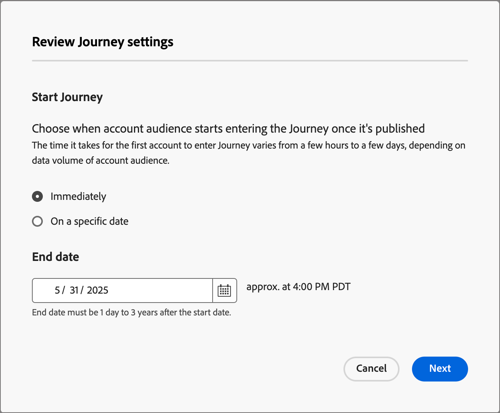

# Skapa och publicera en kontoresa

Om du vill komma igång med en kontoresa skapar du resan och skapar sedan noderna och reseflödet i färdkartan.

{width="30"} [Se översiktsvideon](#overview-video)

## Skapa en kontoresa

1. Klicka på **[!UICONTROL Account journeys]** i den vänstra navigeringen.

1. Klicka på **[!UICONTROL Create Account Journey]** överst till höger på sidan.

1. Ange en unik **[!UICONTROL Name]** (obligatoriskt) och **[!UICONTROL Description]** (valfritt) i dialogrutan.

   {width="400"}

1. Klicka på **[!UICONTROL Create]**.

## Byggstenar i en resa

_resekartan_ är den centrala zonen på arbetsytan för resan. Det är i den här zonen som du kan lägga till och konfigurera resenoder. Klicka på en nod för att öppna dess egenskapspanel till höger om arbetsytan och ange dem i enlighet med din design. En kontoresa börjar alltid med en [målgruppsnod](./account-audience-nodes.md) där du kan lägga till indata till din resa.

När du har skapat en kontoresa och lagt till målgruppen kan du bygga ut resan med hjälp av noder. Färdkartan innehåller en arbetsyta där du kan skapa flerstegs-B2B-användningsfall för marknadsföring med följande nodtyper för att skapa en kontoresa:

* [Agera](./action-nodes.md)
* [Lyssna efter en händelse](./listen-for-event-nodes.md)
* [Dela banor](./split-merge-paths-nodes.md)
* [Vänta](./wait-nodes.md)
* [Sammanfoga banor](./split-merge-paths-nodes.md)

## Guardrails

För att hjälpa dig att bygga en resa utan att stöta på fel finns följande vaktskenor:

* _Om du vill ta bort en delad sökvägsnod_: Om du vill ta bort en nod måste du ta bort alla efterföljande noder i varje sökväg.
* _Tar bort en sammanfogningsnod_: En sammanfogningsnod kan bara tas bort när det finns en ansluten sökväg. Om du vill ta bort en sammanfogningsnod låter du bara en sökväg vara markerad.
* _Växling mellan konto och personer_: Om du ändrar urvalet från konton till personer tas alla efterföljande noder i varje sökväg bort.

## Lägg till en nod

1. Navigera till resekartan.

1. Klicka på plusikonen ( **+** ) på sökvägen och välj nodtyp.

1. Ange nodegenskaperna till höger.

## Ta bort en nod

1. Navigera till resekartan.

1. Klicka på ikonen _Ta bort_ (  ) i nodegenskaperna till höger.

1. Klicka på **[!UICONTROL Delete]** i konformationsdialogrutan.

## Lägga till och ta bort en bana

1. Navigera till resekartan.

1. Klicka på plusikonen ( **+** ) på sökvägen och lägg till den [delade sökvägsnoden](./split-merge-paths-nodes.md#split-paths).

1. Välj **[!UICONTROL Account]** i nodegenskaperna till höger.

1. Klicka på **[!UICONTROL Add path]** om du vill lägga till fler sökvägar.

   För varje bana som skapas under resan visas ett nytt bankort i egenskaperna.

1. Navigera till en av sökvägarna i resan och lägg till noderna [action](./action-nodes.md) eller [event](./listen-for-event-nodes.md) i den här sökvägen med hjälp av plusikonen.

1. Markera noden [delad sökväg](./split-merge-paths-nodes.md) för att öppna egenskaperna till höger.

   Sökvägarna som innehåller noder kan inte tas bort.

1. Om du vill ta bort de här banorna måste du först ta bort alla noder på den banan.

## Schemalägg en resa

När du publicerar en resa kan den påbörjas omedelbart eller på ett schemalagt framtida datum. Slutdatumet kan vara högst tre år från startdatumet. När en resa har publicerats (_Live_ status) kan du uppdatera slutdatumet för resan, men inte startdatumet.

1. Navigera till resekartan.

1. Schemalägg din resa genom att klicka på **[!UICONTROL Journey settings]** i huvudet.

1. Ange schemaalternativen i dialogrutan:

   * Välj en schematyp.

     Om du vill aktivera resan vid publiceringstid väljer du **[!UICONTROL Immediately]**.

     Om du vill aktivera resan för ett framtida datum väljer du **[!UICONTROL On a specific date]** och klickar på ikonen _Kalender_ för att välja datumet.

     {width="400" zoomable="no"}

   * Ange **[!UICONTROL End date]** för resan. Det kan vara högst tre år från startdatumet (det här fältet måste publiceras).

1. Klicka på **[!UICONTROL Save]**.

   När du är redo att publicera din resa kan du granska de här inställningarna när du klickar på _[!UICONTROL Publish]_.

## Publicera en kontoresa

Du kan publicera en resa om det inte finns några fel i blockeringen. När den publiceras ändras resestatusen till _Live_. Om resan innehåller fel tonas knappen _[!UICONTROL Publish]_&#x200B;ned med innehållsinformation: `Resolve errors before publishing`.

>[!NOTE]
>
>Efter publicering av en kontoresa är det upp till 24 timmar kvar innan kvalificerade konton kan komma in på resan.

1. Klicka på **[!UICONTROL Publish]** längst upp till höger på färdkartan.

1. I dialogrutan _[!UICONTROL Review journey settings]_&#x200B;anger du alternativ för start av resan.

   Om du redan har angett inställningar för resan för att definiera ett schema ska du granska inställningarna.

   Om du behöver aktivera resan väljer du en schematyp:

   * Om du vill aktivera resan vid publiceringstid väljer du **[!UICONTROL Immediately]**.

   * Om du vill aktivera resan för ett framtida datum väljer du **[!UICONTROL On a specific date]** och klickar på ikonen _Kalender_ för att välja datumet.

1. Ange **[!UICONTROL End date]** för resan om det behövs.

   {width="400" zoomable="no"}

   Det kan vara högst tre år från startdatumet (det här fältet måste publiceras).

1. Klicka på **[!UICONTROL Next]**.

1. Klicka på **[!UICONTROL Publish]** i bekräftelsedialogrutan.

## Videoöversikt

>[!VIDEO](https://video.tv.adobe.com/v/3443204/?learn=on)
