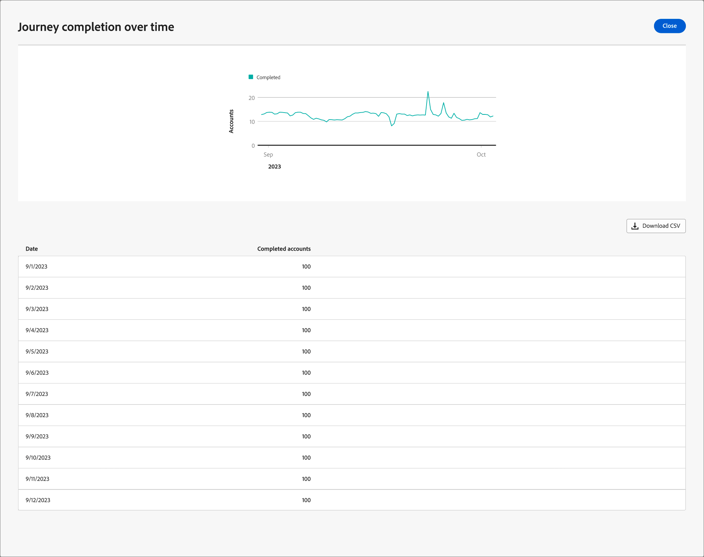

# Resedetaljer

När du klickar på namnet för en aktiv kontoresa visas reseinformationen. Fliken _[!UICONTROL Overview]_innehåller användbar information om resan, inklusive generativa AI-sammanfattningar.

Den här instrumentpanelen ger en omfattande översikt över en vald kontoresa, med detaljerad information om kontostatus med hjälp av cirkel- och linjediagram som kategoriserar och kvantifierar slutföranden, pågående aktiviteter och avbryter över tid. Det hjälper marknadsförarna att utvärdera hur effektiva e-post- och SMS-kanalerna är med hjälp av nyckeltal för leverans och engagemang.

Den här översikten är tillgänglig för publicerade kontoresor och det tar ungefär fyra timmar för data att börja fylla i diagram och tabeller.

{width="700" zoomable="yes"}

## Färdigställande av resa

I det här avsnittet visas två kompletteringsmått:

* **[!UICONTROL Journey status]** - Det här cirkeldiagrammet innehåller en beskrivning av resestatus genom att kategorisera konton i _Slutfört_, _Pågår_ och _Avbrutet_. Varje segment är märkt med motsvarande procenttal och kontonummer på diagrammets ytterkant.
* **[!UICONTROL Journey completion over time]** - Det här linjediagrammet spårar antalet konton som har slutfört sin resa över tid. Den vågräta axeln mappar tidslinjen medan den lodräta axeln kvantifierar kontona, vilket ger en enkel bild av utvecklingstrender.

## Reseengagemang

I det här avsnittet visas två kompletteringsmått:

* **[!UICONTROL Engagement by accounts]** - Det här cirkeldiagrammet segmenterar kontona i en resa till kategorierna _Aktiverat_ och _Inte engagerat_. Den centrala siffran visar det totala antalet. Denna visualisering ger en överblick över kontointeraktionen.
* **Engagemang av personer** - Den här visualiseringen visar det totala antalet personer som är kvalificerade som _engagerade_ i en resa.

## Reseprestanda

I det här avsnittet presenteras två viktiga mätvärden:

* **[!UICONTROL Journey completion rate]** - Procentandel konton som har slutfört sin resa.
* **[!UICONTROL Journey duration]** - Genomsnittlig tid för konton att slutföra deras resa.

## E-post- och SMS-prestanda

Prestandatabellerna ger en detaljerad bild av hur effektiva e-post- och SMS-kanalerna är. Varje tabell visar mätvärden, som leveransfrekvenser och klickfrekvens, som hjälper dig att bedöma effekten av varje kontaktyta.

**[!UICONTROL Email performance]** tabellkolumner:

* _[!UICONTROL Asset name]_- resursens namn
* _[!UICONTROL Sent]_- antal skickade e-postmeddelanden
* _[!UICONTROL Delivery rate]_- antal levererade e-postmeddelanden dividerat med antalet skickade
* _[!UICONTROL Open Rate]_- antal öppnade e-postmeddelanden delat med antalet levererade
* _[!UICONTROL Click-through rate]_- antal klickade e-postmeddelanden dividerat med antalet levererade

**[!UICONTROL SMS performance]** tabellkolumner:

* _[!UICONTROL Asset name]_- resursens namn
* _[!UICONTROL Sent]_- antal skickade SMS-meddelanden
* _[!UICONTROL Delivery rate]_- antalet levererade SMS-meddelanden delat med det skickade numret
* _[!UICONTROL Click-through rate]_- antalet klickade SMS-meddelanden dividerat med antalet levererade
<!-- 
To generate a shareable PDF of your current view, click **[!UICONTROL Export]** at the top right of the page. -->

## Förbättrad interaktion

Engagera dig ytterligare med data genom att använda åtgärdsikonen (**...**) i det övre högra hörnet i varje diagram eller tabell.

### Detaljgranskning

För diagrammet _[!UICONTROL Journey status]_väljer du **[!UICONTROL Drill through]**för en ingående analys av enskilda kontostatusar.

{width="600" zoomable="yes"}
<!--
The applied global filters are carried over to the view and displayed at the top. Click the _Filter_ icon at the top left to filter the data display by journey.-->

### Visa mer

Välj **[!UICONTROL View more]** om du vill komma åt utökade data. Det visade popup-fönstret innehåller en beskrivning av data.

{width="600" zoomable="yes"}

Om du vill hämta data klickar du på **[!UICONTROL Download CSV]** längst upp till höger i datatabellen. Klicka på **[!UICONTROL Close]** om du vill återgå till kontrollpanelen _Översikt_.
