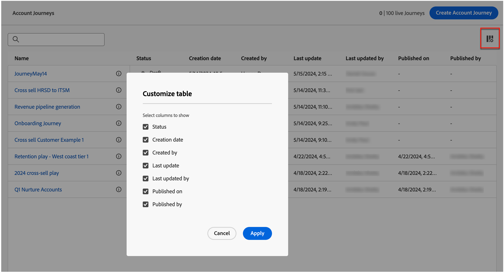

# Kontoresor

Bygg och genomför kundresor som är skräddarsydda för varje inköpsgrupp och köpgruppsmedlem med hjälp av automatiserat engagemang via e-post, SMS, event med mera. Med kontoresor kan ni effektivisera efterfrågefunktionen och köpa upp gruppbehörigheter och öka efterfrågan på ert förvärv, merförsäljning/korsförsäljning och lojalitetsprogram.

Definiera säljdriven interaktion som inkluderar e-post, SMS och andra kundresor för att koordinera inkommande marknadsföring med utgående försäljningsaktiviteter för varje medlem i köpgruppen.

{width="30"} [Se översiktsvideon](#overview-video)

## Få åtkomst till och bläddra bland kontoresor

1. Klicka på Adobe Journey Optimizer B2B edition på startsidan för Adobe Experience Platform.

1. Klicka på **[!UICONTROL Account journeys]** i den vänstra navigeringen.

   {width="800" zoomable="yes"}

   Den visade resesidan innehåller följande kolumner:

   * [!UICONTROL Name] (klicka på namnet för att öppna kontoresan för redigering)
   * [!UICONTROL Status]
   * [!UICONTROL Description]
   * [!UICONTROL Created by]
   * [!UICONTROL Last updated at]
   * [!UICONTROL Last updated by]
   * [!UICONTROL Published on]
   * [!UICONTROL Published by]

Tabellen innehåller möjligheten att söka efter namn och skapad av. Sortering är inte tillgängligt just nu.

Du kan anpassa den visade tabellen genom att klicka på ikonen _Kolumner_ i det övre högra hörnet och markera eller avmarkera kryssrutorna.

{width="800" zoomable="yes"}

## Analys av en kontoresa

Klicka på namnet (visas som en länk) i listan _[!UICONTROL Account journeys]_om du vill granska informationen, göra ändringar och vidta åtgärder.

{width="800" zoomable="yes"}

Redigeringsrubriken för varje kontoresa omfattar:

* Resensnamn
* Möjlighet att redigera namnet (_ikonen Redigera_)
* Status för resan

Följande åtgärder är tillgängliga i sidhuvudet:

* **Publicera** - Du kan publicera en resa om det inte finns några blockeringsfel. När den publiceras ändras resestatusen till _Live_. Om resan innehåller fel tonas knappen ned med innehållsinformation: `Resolve errors before publishing`.
* **Duplicera** - Den här åtgärden liknar en klonfunktion, men den duplicerade resan innehåller inga resurser.
* **Nära nya poster** - Om du stänger en resa fortsätter konton som för närvarande befinner sig på resan att vara på vägen och ingen ytterligare reseentré kan ske. Det går inte att starta om en stängd resa. Du kan duplicera en stängd resa.
* **Avbryt** - Om du avbryter en resa avbryts kundens framsteg omedelbart om du gör en ny resa. Det går inte att starta om en stoppad resa. Om du blockerar nya ingångar utan att stoppa folks framsteg, överväg att stänga resan istället.
* **Ta bort** - Den här åtgärden tar bort resan permanent.

Status för en resa ändras baserat på de åtgärder som du tillämpar. Beroende på statusen för en resa är vissa åtgärder inte tillgängliga i sidhuvudet.

| Status | Beskrivning | Tillgängliga åtgärder |
| ------ | ----------- | ----------------- |
| _**Utkast**_ | En opublicerad resa som är redigerbar. | <ul><li>Publicera</li><li>Duplicera </li><li>Ta bort </li></ul> |
| _**Live**_ | Resans status ändras från utkast till Live när en resa publiceras. I det här läget går det inte längre att redigera. | <ul><li>Duplicera </li><li>Stäng till nya poster </li><li>Avbryt </li></ul> |
| _**Stängda till nya poster**_ | Resursstatusen ändras från _Live_ till _Stängd till nya poster_ när du klickar på [!UICONTROL Close to new entries] i den övre navigeringen. | <ul><li>Duplicera </li><li>Avbryt </li></ul> |
| _**Avbruten**_ | Resans status ändras från _Live_ eller _Stängd till nya poster_ när du avbryter en resa. En avbruten resa kan inte startas om. | <ul><li>Duplicera </li><li>Ta bort </li></ul> |
| _**Slutförd**_ | När alla konton i en resa har slutfört resan ändras statusen från Live eller Stängd till nya poster till Slutförd. | <ul><li>Duplicera </li><li>Ta bort </li></ul> |

## Kom igång med en resa

Så här kommer du igång med kontoresor:

1. [Skapa en resa](./create-publish-journey.md#create-an-account-journey).
1. [Lägg till noderna](./create-publish-journey.md#add-a-node) och [definiera reseflödet](./create-publish-journey.md#add-and-delete-a-path) i färdkartan.
1. [Publicera resan](./create-publish-journey.md#publish-an-account-journey).

## Videoöversikt

>[!VIDEO](https://video.tv.adobe.com/v/3443202/?learn=on)
