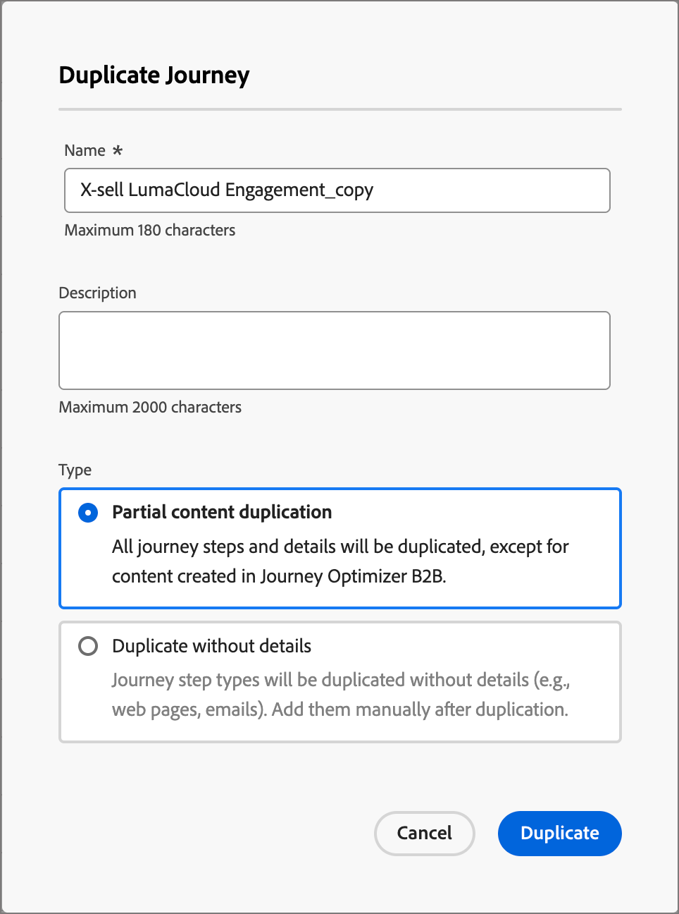

# Kontoresor

Med kontoresor kan ni effektivisera efterfrågefunktionen och köpa upp gruppkvalifikationer och få en mer kvalificerad efterfrågan på era köp-, merförsäljnings-/korsförsäljningsprogram samt lojalitetsprogram. Skräddarsy era resor för varje inköpsgrupp och medlem i inköpsgruppen med hjälp av automatiserat engagemang via e-post, SMS, event med mera.

Definiera säljdriven interaktion som inkluderar e-post, SMS och andra kundresor för att koordinera inkommande marknadsföring med utgående försäljningsaktiviteter för varje medlem i köpgruppen.

{width="30"} [Se översiktsvideon](#overview-video)

## Kom igång med en resa

Så här kommer du igång med kontoresor:

1. [Skapa en resa](./create-publish-journey.md#create-an-account-journey).
1. [Lägg till noderna](./create-publish-journey.md#add-a-node) och [definiera reseflödet](./create-publish-journey.md#add-and-delete-a-path) i färdkartan.
1. [Publicera resan](./create-publish-journey.md#publish-an-account-journey).

## Få åtkomst till och bläddra bland kontoresor

Klicka på **[!UICONTROL Account journeys]** i den vänstra navigeringen.

{width="800" zoomable="yes"}

Den visade resesidan innehåller följande kolumner:

* [!UICONTROL Name] (klicka på namnet för att öppna resan för redigering)
* [!UICONTROL Status]
* [!UICONTROL Description]
* [!UICONTROL Created by]
* [!UICONTROL Last updated at]
* [!UICONTROL Last updated by]
* [!UICONTROL Published on]
* [!UICONTROL Published by]

Använd _sökverktyget_ längst upp för att hitta resan efter namn. Du kan sortera listan efter _[!UICONTROL Status]_&#x200B;genom att klicka på kolumnrubriken.

Du kan anpassa kolumnerna som visas i tabellen genom att klicka på ikonen _Anpassa tabell_ (  ) i det övre högra hörnet. Markera eller avmarkera kryssrutorna i dialogrutan och klicka på **[!UICONTROL Apply]**.

{width="800" zoomable="yes"}

## Analys av en kontoresa

Klicka på namnet (visas som en länk) i listan _[!UICONTROL Account journeys]_&#x200B;om du vill granska informationen, göra ändringar och vidta åtgärder.

{width="800" zoomable="yes"}

Huvudet för varje kontoresekarta omfattar:

* Resensnamn
* Åtkomst för att redigera resenamnet ( ikonen  _Redigera_ )
* Status för resan

Status för en resa kan ändras beroende på vilka åtgärder du vidtar. Beroende på statusen för en resa är vissa åtgärder inte tillgängliga från den högra sidan av huvudet.

| Status | Beskrivning | Tillgängliga åtgärder |
| ------ | ----------- | ----------------- |
| _&#x200B;**Utkast**&#x200B;_ | En opublicerad resa som är redigerbar. | <ul><li>[Publicera](./create-publish-journey.md#publish-an-account-journey)</li><li>Duplicera </li><li>Ta bort </li></ul> |
| _&#x200B;**Live**&#x200B;_ | Resans status ändras från utkast till Live när en resa publiceras. I det här läget går det inte längre att redigera. | <ul><li>Duplicera </li><li>Stäng till nya poster </li><li>Avbryt </li></ul> |
| _&#x200B;**Stängda till nya poster**&#x200B;_ | Resursstatusen ändras från _Live_ till _Stängd till nya poster_ när du klickar på [!UICONTROL Close to new entries] i den övre navigeringen. | <ul><li>Duplicera </li><li>Avbryt </li></ul> |
| _&#x200B;**Avbruten**&#x200B;_ | Resans status ändras från _Live_ eller _Stängd till nya poster_ när du avbryter en resa. En avbruten resa kan inte startas om. | <ul><li>Duplicera </li><li>Ta bort </li></ul> |
| _&#x200B;**Slutförd**&#x200B;_ | När alla konton i en resa har slutfört resan ändras statusen från Live eller Stängd till nya poster till Slutförd. | <ul><li>Duplicera </li><li>Ta bort </li></ul> |

## Hantera resor

Listan _Kontoresor_ innehåller alla resor i din Journey Optimizer B2B edition-instans.

### Avbryta resan

Om du avbryter (stoppar) en live eller schemalagd resa avbryter konton i resan omedelbart deras framsteg och ingen ytterligare reseentré kan ske. En avbruten resa kan inte startas om.

>[!IMPORTANT]
>
>När kontoresan används i en annan resa från en _Ta en åtgärd_-nod med åtgärden _Lägg till konto till (annan) resa_ och avbryter den resan från den resan.

1. Klicka på resenamnet för att öppna det.

1. Klicka på menyn **[!UICONTROL More...]** längst upp till höger och välj **[!UICONTROL Abort]**.

   {width="450"}

1. Klicka på **[!UICONTROL Abort]** i bekräftelsedialogrutan.

### Stäng till nya poster

Om du stänger en live-resa fortsätter konton som för närvarande befinner sig på resan att ta sin väg på den resan och ingen ytterligare reseentré kan ske. Det går inte att starta om en stängd resa. Du kan duplicera en stängd resa.

>[!IMPORTANT]
>
>När kontoresan används i en annan resa från en _Ta en åtgärd_-nod med åtgärden _Lägg till konto till (annan) resa_ och stäng den till nya poster blockerar åtgärden från den resan.

1. Klicka på resenamnet för att öppna det.

1. Klicka på menyn **[!UICONTROL More...]** längst upp till höger och välj **[!UICONTROL Close to new entries]**.

1. Klicka på **[!UICONTROL Close to new entries]** i bekräftelsedialogrutan.

### Duplicera resa

En duplicerad åtgärd liknar en klonfunktion, men en duplicerad resa innehåller inte något skapat innehåll för resan. Du kan duplicera informationen för kontoresan eller bara en enkel _skelett_ av flödes- och sökvägsstrukturen.

1. Klicka på ikonen _Mer_ (**..**) bredvid resans namn och välj **[!UICONTROL Duplicate]**.

   {width="450"}

   Beroende på statusen för kontoresan kan du även komma åt den duplicerade åtgärden från reseinformationen eller färdkartan:

   * Klicka på menyn **[!UICONTROL More...]** längst upp till höger och välj **[!UICONTROL Duplicate]** för ett utkast.

   * Klicka **[!UICONTROL Duplicate]** längst upp till höger för alla andra statuslägen för resan.

     {width="450"}

1. I dialogrutan _Duplicera resa_ anger du **[!UICONTROL Name]** och **[!UICONTROL Description]** för den nya resan.

   Som standard används namnet på den duplicerade resan som har lagts till med __copy_ i dialogrutan. Ange ett annat unikt namn för resan efter behov.

   {width="400"}

1. Välj dupliceringen **[!UICONTROL Type]**:

   * **[!UICONTROL Partial content duplication]** - Använd den här typen om du vill kopiera allt på resan, exklusive skapade e-postmeddelanden eller SMS-meddelanden. Noder som refererar till ett Marketo Engage-mejl eller SMS är helt intakta.

   * **[!UICONTROL Duplicate without details]** - Använd den här typen för att endast kopiera nodstrukturen och sökvägarna. Alla nodinställningar och sökvägsvillkor är odefinierade (standard), så att du kan återanvända basflödet med olika inställningar för målgrupper, åtgärder och bansegmentering. Alla _Wait_-noder använder standardvärdet på fem dagar.

1. Klicka på **[!UICONTROL Duplicate]**.

   Den duplicerade kontoresan öppnas i färdkartan, där du kan ange detaljer och skapa kundreseinnehåll efter behov.

### Ta bort resa

Använd en raderingsåtgärd för att ta bort en resa permanent. Du kan inte ta bort en direktsänd eller schemalagd resa.

1. Klicka på ikonen _Mer_ (**..**) bredvid resans namn och välj **[!UICONTROL Delete]**.

   Beroende på statusen för kontoresan kan du även komma åt borttagningsåtgärden från reseinformationen eller färdkartan:

   * Klicka på menyn **[!UICONTROL More...]** längst upp till höger och välj **[!UICONTROL Delete]** för ett utkast.

   * Klicka **[!UICONTROL Delete]** längst upp till höger för andra status för resan, till exempel _Slutförd_ eller _Avbruten_.

1. Klicka på **[!UICONTROL Delete]** i bekräftelsedialogrutan.

## Videoöversikt

>[!VIDEO](https://video.tv.adobe.com/v/3443202/?learn=on)
