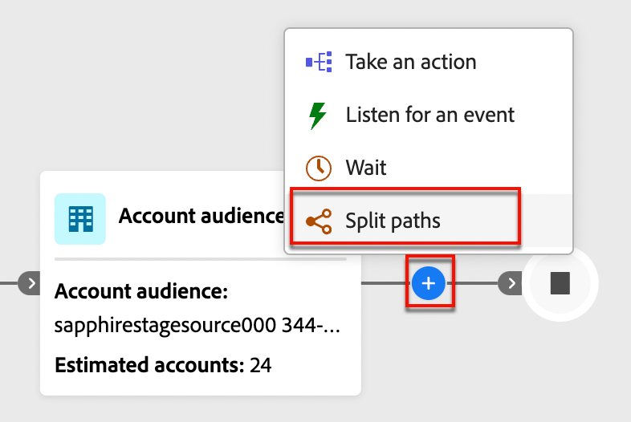

# Dela och sammanfoga banor

Använd delade och sammanfogade sökvägsnoder i din kontoresa för att samordna dina kontoresor. Du kan segmentera målgruppen enligt villkor som du definierar och kombinerar segmenten för att fortsätta.

{width="30"} [Se översiktsvideon](#overview-video)

## Dela banor

Lägg till en _delad banor_-nod för att definiera en eller flera segmenterade banor baserat på konto- eller personattribut.

>[!NOTE]
>
>Högst 25 banor stöds.

**Dela sökvägar efter konton**: Sökvägar som delas efter konton kan innehålla både konto- och personåtgärder samt händelser. Dessa banor kan delas upp ytterligare.

_Hur fungerar en delad sökväg efter kontonod?_

* Varje sökväg som du lägger till innehåller en slutnod med möjlighet att lägga till noder i varje kant.
* Dela efter kontonoder kan kapslas - du kan dela upp sökvägen efter konton flera gånger.
* Utvärderar banor uppifrån och ned. Om ett konto matchar den första och den andra sökvägen fortsätter det bara längs den första.
* Två eller flera sökvägar kan kombineras med en sammanfogningsnod.
* Stöder definitionen av en _[!UICONTROL Other accounts]_-sökväg, där du kan lägga till åtgärder eller händelser för konton som inte matchar något av de definierade segmenten/sökvägarna.

{width="700" zoomable="yes"}

**Dela banor efter personer**: Banor som delas av personer och kan endast innehålla personåtgärder. Dessa banor kan inte delas igen och kopplas automatiskt tillbaka.

_Hur fungerar en delad sökväg efter personnod?_

* Funktioner i en _grupperad nod_-kombination med delad sammanslagning. De delade banorna sammanfogas automatiskt så att alla personer i publiken kan gå vidare till nästa steg utan att kontexten för deras konton försvinner.
* Delning efter personnoder kan inte kapslas. Du kan inte lägga till en delad sökväg för personer på en sökväg som finns i den här grupperade noden.
* Utvärderar banor uppifrån och ned. Om en person matchar den första och den andra banan fortsätter de bara längs den första banan.
* Stöder användningen av _konto-person-relationer_, som gör att du kan filtrera personer baserat på deras roll (till exempel leverantör eller heltidsanställd) enligt vad som definierats i rollmallarna.
* Stöder definitionen av en _[!UICONTROL Other people]_-sökväg, där du kan lägga till åtgärder eller händelser för personer som inte matchar något av de definierade segmenten/sökvägarna.

{width="700" zoomable="yes"}

### Sökvillkor {#path-conditions}

| Nodkontext | Sökvillkor | Beskrivning |
| ------------ | --------------- | ----------- |
| [Konton](#add-a-split-path-by-account-node) | Kontoattribut | Attribut från kontoprofilen, inklusive: <li>Årliga intäkter</li><li>Ort</li><li>Land</li><li>Medarbetarstorlek</li><li>Bransch</li><li>Namn</li><li>SIC-kod</li><li>Stat</li> |
| | [!UICONTROL Special filters] > [!UICONTROL Has Buying Group] | Kontot har eller saknar medlemmar i inköpsgrupper. Kan även utvärderas mot ett eller flera av följande kriterier: <li>Intresse av lösningar</li><li>Status för inköpsgrupp</li><li>Slutförandepoäng</li><li>Engagement Score</li> |
| | [!UICONTROL Special filters] > [!UICONTROL Has opportunity] | Kontot är eller är inte relaterat till en affärsmöjlighet. Kan även utvärderas mot ett eller flera av följande affärsmöjlighetsattribut: <li>Belopp<li>Stängningsdatum<li>Beskrivning<li>Förväntade intäkter<li>Räkenskapskvartal<li>Räkenskapsår<li>Prognoskategori<li>Prognoskategorinamn<li>Är stängd<li>Är vunnen</li><li>Senaste aktivitetsdatum</li><li>Personkälla<li>Namn</li><li>Nästa steg</li><li>Sannolikhet<li>Kvantitet<li>Scen</li><li>Typ |
| [Personer](#add-a-split-path-by-people-node) > [!UICONTROL People attributes only] | [!UICONTROL Person Attributes] | Attribut från personprofilen, inklusive: <li>Ort</li><li>Land</li><li>Födelsedatum</li><li>E-postadress</li><li>Ogiltig e-postadress</li><li>E-postmeddelandet har pausats</li><li>Förnamn</li><li>Ingångsregion</li><li>Befattning</li><li>Efternamn</li><li>Mobiltelefonnummer</li><li>Telefonnummer</li><li>Postnummer</li><li>Stat</li><li>Avprenumererad</li><li>Orsak till avbeställning</li> |
| | [!UICONTROL Activity history] > [!UICONTROL Email] | E-postaktiviteter som är kopplade till resan: <li>[!UICONTROL Clicked link in email]</li><li>Öppen e-post</li><li>Levererades via e-post</li><li>Har skickats e-post</li> Dessa villkor utvärderas med hjälp av ett markerat e-postmeddelande från tidigare under resan. |
| | [!UICONTROL Activity history] > [!UICONTROL SMS Message] | SMS-aktiviteter som är kopplade till resan: <li>[!UICONTROL Clicked link in SMS]</li><li>[!UICONTROL SMS Bounced]</li>Dessa villkor utvärderas med ett valt SMS-meddelande från tidigare under resan. |
| | [!UICONTROL Activity history] > [!UICONTROL Data Value Changed] | En värdeändring har gjorts för ett markerat personattribut. De här ändringstyperna är: <li>Nytt värde</li><li>Föregående värde</li><li>Orsak</li><li>Källa</li><li>Aktivitetsdatum</li><li>Min. antal gånger</li> |
| | [!UICONTROL Activity history] > [!UICONTROL Had Interesting Moment] | Intressanta ögonblick som definieras i den associerade Marketo Engage-instansen. Begränsningarna är: <li>Milstolpe</li><li>E-post</li><li>Webb</li> |
| | [!UICONTROL Special filters] > [!UICONTROL Member of Buying Group] | Personen är eller är inte medlem i en inköpsgrupp och utvärderas utifrån ett eller flera av följande kriterier: <li>Intresse av lösningar</li><li>Status för inköpsgrupp</li><li>Slutförandepoäng</li><li>Engagement Score</li><li>Roll</li> |
| | [!UICONTROL Special filters] > [!UICONTROL Member of List] | Personen är eller är inte medlem i en eller flera Marketo Engage-listor. |
| | [!UICONTROL Special filters] > [!UICONTROL Member of Program] | Personen är eller är inte medlem i ett eller flera Marketo Engage-program. |
| [Personer](#add-a-split-path-by-people-node) > [!UICONTROL Account-person attributes only] | Roll i kontoattribut | Personen har eller har inte tilldelats en roll i kontot. Valfria begränsningar: <li>Ange ett rollnamn</li> |

### Lägg till en delad sökväg efter kontonod

1. Navigera till reseeditorn.

1. Klicka på plusikonen ( **+** ) på en bana och välj **[!UICONTROL Split paths]**.

   {width="300"}

1. I nodegenskaperna till höger väljer du **[!UICONTROL Accounts]** för delningen.

1. Om du vill definiera ett villkor som gäller för _[!UICONTROL Path 1]_klickar du på&#x200B;**[!UICONTROL Apply condition]**.

   {width="500"}

1. I villkorsredigeraren lägger du till ett eller flera filter för att definiera den delade banan.

   * Dra och släpp filterattribut från den vänstra navigeringen och slutför matchningsdefinitionen.

   * Finjustera dina villkor genom att använda **[!UICONTROL Filter logic]** överst. Du väljer att matcha alla attributvillkor eller alla villkor.

     {width="700" zoomable="yes"}

   * Klicka på **[!UICONTROL Done]**.

1. Om du vill lägga till fler sökvägar klickar du på **[!UICONTROL Add path]** och upprepar de föregående stegen för att lägga till villkor som gäller för den här sökvägen.

   Du kan också etikettera varje bana baserat på dessa villkor eller använda standardetiketterna.

1. Om det behövs ändrar du ordningen på banorna enligt den prioritet du vill dela upp.

   Banfiltrering utvärderas i den nedrullningsbara ordningen. Varje konto fortsätter längs den första matchande sökvägen.

   Klicka på upp- och nedpilarna längst upp till höger på varje bankort för att flytta det högre eller lägre i listan med banor.

   {width="500" zoomable="yes"}

1. Aktivera alternativet **[!UICONTROL Other accounts]** för att definiera standardsökvägen för konton som inte matchar de definierade segmenten/sökvägarna.

   När det här alternativet inte är aktiverat avslutas resan för konton som inte matchar ett definierat segment/en definierad bana i delningen.

### Lägga till en delad sökväg efter personnod

>[!NOTE]
>
>När du delar banor efter personer infogas en _Close split paths_ -nod automatiskt för att avsluta delningen. En delad sökväg för personer tillåter bara _Vidta en åtgärd_ på personnoder.

1. Navigera till reseeditorn.

1. Klicka på plusikonen ( **+** ) på en bana och välj **[!UICONTROL Split paths]**.

   {width="300"}

1. I nodegenskaperna till höger väljer du **[!UICONTROL People]** för delningen.

1. Ange **[!UICONTROL Attributes used for conditions]**.

   * Välj **[!UICONTROL People attributes only]** om du vill använda villkor som är relaterade till personprofilen och händelserna.
   * Välj **[!UICONTROL Account-person attributes only]** om du vill använda villkor som är relaterade till personens rollmedlemskap i ett konto.

1. Om du vill definiera ett villkor som gäller för _[!UICONTROL Path 1]_klickar du på&#x200B;**[!UICONTROL Apply condition]**.

1. I villkorsredigeraren lägger du till ett eller flera filter för att definiera den delade banan.

   * Dra och släpp någon av personattributen från den vänstra navigeringen och fyll i matchningsdefinitionen.

     >[!NOTE]
     >
     >Om du har definierat anpassade personfält i kontots målgruppsschema i Experience Platform är dessa fält även tillgängliga som personattribut under villkor.

   * Finjustera dina villkor genom att använda **[!UICONTROL Filter logic]** överst. Du väljer att matcha alla attributvillkor eller alla villkor.

     {width="700" zoomable="yes"}

   * Klicka på **[!UICONTROL Done]**.

1. Om du vill lägga till fler sökvägar klickar du på **[!UICONTROL Add path]** och upprepar de föregående stegen för att lägga till villkor som gäller för den här sökvägen.

   Du kan också etikettera varje bana baserat på dessa villkor eller använda standardetiketterna.

1. Om det behövs ändrar du ordningen på banorna enligt den prioritet du vill dela upp.

   Banfiltrering utvärderas i den nedrullningsbara ordningen. Varje person fortsätter längs den första matchande banan.

   Klicka på upp- och nedpilarna längst upp till höger på varje bankort för att flytta det högre eller lägre i listan med banor.

   {width="500" zoomable="yes"}

1. Aktivera alternativet **[!UICONTROL Other people]** om du vill lägga till en standardsökväg för personer som inte matchar de definierade sökvägarna.

   När det här alternativet inte är aktiverat flyttas personer som inte matchar ett definierat segment/en definierad bana förbi delningen och fortsätter till nästa steg i resan.

>[!BEGINSHADEBOX &quot;Marketo Engage listmedlemskap&quot;]

I Marketo Engage kontrollerar _smarta kampanjer_ medlemskap i program för att se till att leads inte får dubbla e-postmeddelanden och inte är medlemmar i flera e-postströmmar samtidigt. I Journey Optimizer B2B kan du kontrollera om det finns ett listmedlemskap i Marketo Engage som ett villkor för att få en delad kundresa. På så sätt slipper du dubbelarbete under resan.

Om du vill använda listmedlemskap i ett delat villkor expanderar du **[!UICONTROL Special Filters]** och drar villkoret **[!UICONTROL Member of List]** till filterområdet. Slutför filterdefinitionen för att utvärdera medlemskap i en eller flera Marketo Engage-listor.

{width="700" zoomable="yes"}

>[!ENDSHADEBOX]

När du har definierat villkor för varje bana för att dela din publik på personnivå, kan du lägga till åtgärder som du vill ska utföras på personer.

>[!NOTE]
>
>När du delar målgruppen efter personer kan du bara lägga till åtgärder för personer tills banorna är stängda eller sammanslagna.

## Sammanfoga banor

Lägg till en _sammanfoga sökvägar_-nod för att kombinera olika delade sökvägar efter konto på din resa.

1. Navigera till reseeditorn.

1. Klicka på plusikonen ( **+** ) på en bana och välj **[!UICONTROL Split paths]**.

1. Klicka på den delade noden för att öppna dess egenskaper till höger.

1. Klicka på [!UICONTROL Add path] om du vill skapa tre banor.

1. Lägg till en kombination av åtgärder och händelser i varje sökväg.

1. Klicka på plusikonen ( **+** ) för någon av dessa banor och välj **[!UICONTROL Merge]** bland de visade alternativen.

   {width="400"}

1. Markera de banor som du vill sammanfoga i nodegenskaperna för sammanfogningssökvägar.

   {width="600" zoomable="yes"}

   Nu sammanfogas banorna så att konton från de markerade banorna kombineras till en enda bana som kan fortsätta genom resan.

1. Om det behövs kan du dela upp sökvägarna genom att gå tillbaka till egenskaperna för sammanfogningssökvägarna och avmarkera kryssrutan för de sökvägar som du vill ta bort.

## Videoöversikt

>[!VIDEO](https://video.tv.adobe.com/v/3443231/?learn=on)
