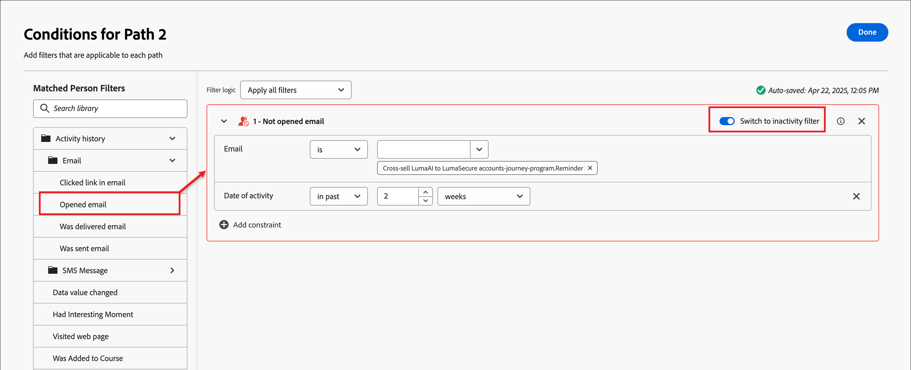

# Dela och sammanfoga banor

Använd delade och sammanfoga bannoder för att segmentera personer eller konton enligt de villkor som du anger. Skapa sökvägar för målgruppen eller kontolistan utifrån villkor, definiera varje bana med action- och event-noder för segmentet och kombinera sedan banorna och fortsätt kundresan.

{width="30"} [Se översiktsvideon](#overview-video)

En _delad banor_-nod definierar en eller flera segmenterade banor som baseras på **_antingen_**-konto eller personfilter. En delning som baseras på ett personfilter stängs automatiskt med en sammanfogningssökvägsnod så att alla kan gå vidare till nästa steg utan att kontextkontexten försvinner.

>[!NOTE]
>
>Högst 25 banor stöds.

## Dela sökvägar efter konton

(Endast kontoresor)

Sökvägar som delas efter konton kan innehålla både konto- och personåtgärder samt händelser. Dessa banor kan delas upp ytterligare.

_&#x200B;**Så här fungerar en delad sökväg efter kontonod**&#x200B;_

* Varje sökväg som du lägger till innehåller en slutnod med möjlighet att lägga till noder i varje kant.
* Dela efter kontonoder kan kapslas (du kan dela upp sökvägen efter konton flera gånger).
* Utvärderingen av varje bana görs uppifrån och ned. Om ett konto matchar den första och den andra sökvägen fortsätter det bara längs den första.
* Två eller flera sökvägar kan kombineras med en sammanfogningsnod.
* Noden stöder definitionen av en _[!UICONTROL Other accounts]_-sökväg, där du kan lägga till åtgärder eller händelser för konton som inte matchar något av de definierade segmenten/sökvägarna.

{width="700" zoomable="yes"}

### Sökvägsvillkor för konto

| Sökvillkor | Beskrivning |
| --------------- | ----------- |
| Kontoattribut | Attribut från kontoprofilen, inklusive: <li>Årliga intäkter <li>Ort <li>Land <li>Medarbetarstorlek <li>Bransch <li>Namn <li>SIC-kod <li>Stat <li>Har `<relational schema>` (se [Egen datafiltrering](#custom-data-filtering)) |
| [!UICONTROL Special filters] > [!UICONTROL Account has matched buying group] | Kontot matchas med en eller flera inköpsgrupper. Den kan utvärderas mot en eller flera av följande begränsningar för en matchad köpgrupp: <li>Intresse av lösningar <li>Buying Group stage <li>Status för inköpsgrupp <li>Engagement Score <li>Slutförandepoäng <li> Antal personer i inköpsgruppsroll |
| [!UICONTROL Special filters] > [!UICONTROL Has Buying Group] | Kontot har eller saknar medlemmar i inköpsgrupper. Den kan också utvärderas mot ett eller flera av följande kriterier: <li>Intresse av lösningar <li>Buying Group stage <li>Status för inköpsgrupp <li>Engagement Score <li>Slutförandepoäng |

>[!NOTE]
>
>Filtret _[!UICONTROL Has Buying Group]_&#x200B;har markerats för framtida borttagning. Använd filtret&#x200B;_[!UICONTROL Account has matched buying group]_ för nya resor, som innehåller samma begränsningar.

### Lägg till en delad sökväg efter kontonod

1. Navigera till resekartan.

1. Klicka på plusikonen ( **+** ) på en bana och välj **[!UICONTROL Split paths]**.

   {width="300" zoomable="no"}

1. I nodegenskaperna till höger väljer du **[!UICONTROL Accounts]** för delningen.

1. Om du vill definiera ett villkor som gäller för _[!UICONTROL Path 1]_&#x200B;klickar du på&#x200B;**[!UICONTROL Apply condition]**.

   {width="500" zoomable="yes"}

1. I villkorsredigeraren lägger du till ett eller flera filter för att definiera den delade banan.

   * Dra och släpp filterattribut från den vänstra navigeringen och slutför matchningsdefinitionen.

   * Finjustera dina villkor genom att använda **[!UICONTROL Filter logic]** överst. Du väljer att matcha alla filter eller något filter.

     {width="700" zoomable="yes"}

   * Klicka på **[!UICONTROL Done]**.

1. Om du vill lägga till fler sökvägar klickar du på **[!UICONTROL Add path]** och upprepar de föregående stegen för att lägga till villkor som gäller för den här sökvägen.

   Du kan också etikettera varje bana baserat på dessa villkor eller använda standardetiketterna.

1. Om det behövs ändrar du ordningen på banorna enligt den prioritet du vill dela upp.

   Banfiltrering utvärderas i den nedrullningsbara ordningen. Varje konto fortsätter längs den första matchande sökvägen.

   Klicka på upp- och nedpilarna längst upp till höger på varje bankort för att flytta det högre eller lägre i listan med banor.

   {width="500" zoomable="yes"}

1. Aktivera alternativet **[!UICONTROL Other accounts]** för att definiera standardsökvägen för konton som inte matchar de definierade segmenten/sökvägarna.

   När det här alternativet inte är aktiverat avslutas resan för konton som inte matchar ett definierat segment/en definierad bana i delningen.

### Köpa gruppfiltrering för konton {#buying-group-filtering-accounts}

Du kan definiera en sökväg för konton som är kopplade till inköpsgrupper och filtrera sökvägen med hjälp av villkor för inköpsgrupper. Använd filtret **[!UICONTROL Account has matched buying group]** för att definiera sökvägssegmentet med en matchande inköpsgrupp. Det här filtret innehåller även det alternativet för att identifiera konton baserat på antalet tilldelade roller i en matchad inköpsgrupp.

Du kan till exempel vilja utvärdera om inköpsgrupper är redo utifrån hur många (antal personer) de har i olika roller, till exempel tre beslutsfattare och två påverkare. I detta fall ska villkoret vara inriktat på konton med minst tre (3) beslutsfattare och två (2) påverkare i en matchad köpgrupp:

1. Klicka på **[!UICONTROL Add filter]** och välj filtret **[!UICONTROL Number of people in buying group role]**.

   {width="700" zoomable="yes"}

1. Definiera den första rollparametern.

   * Ange antalet personer som ska utvärderas till `at least` med värdet `3`.
   * Ange att rollutvärderingen ska vara `is` och välj `Decision Maker` i listan med roller.

1. Upprepa steg 1 om du vill lägga till en till parameter för köpgruppsroll.

1. Definiera den andra rollparametern.

   * Ange antalet personer som ska utvärderas till `at least` med värdet `2`.
   * Ange att rollutvärderingen ska vara `is` och välj `Influencer` i listan med roller.

   {width="700" zoomable="yes"}

1. Klicka på **[!UICONTROL Done]** när du har angett alla villkor för sökvägen.

För de identifierade kontona kanske du vill lägga till en åtgärdsnod i sökvägen för att uppdatera statusen för inköpsgruppen eller scenen, eller för att skicka ett e-postmeddelande om försäljning.

### Anpassad datafiltrering

[!BADGE Beta]{type=Informative url="/help/user/admin/engagement-score-weighting.md" tooltip="Finns som betaversion av den förenklade arkitekturen"}

Du kan använda relationsscheman (modellbaserade klasser) för att dela banor efter konto. De anpassade objekten definieras i _relationsscheman_, och en produktadministratör kan [konfigurera relationsschemafält &#x200B;](../admin/xdm-field-management.md#relational-schemas) i [!DNL Journey Optimizer B2B Edition]. De markerade schemafälten är tillgängliga i villkorsredigeraren och kan användas i delade sökvägar efter kontonoder.

{width="700" zoomable="yes"}

<!-- SPHR-23746

Note: These are currently going under Account Attributes folder, which is a bug (SPHR-21734). This will move to Special filters when resolved (January release).

This will also be available for split paths by people (under special filters) for the M 1.5 GA release.
-->

## Dela banor efter personer

Delade efter personsökvägar kan endast innehålla personåtgärder. Dessa banor kan inte delas igen och kopplas automatiskt tillbaka.

_&#x200B;**Så här fungerar en delad sökväg med personnod**&#x200B;_

* Dela efter personnoder i en _grupperad nod_, delad sammanslagning. De delade banorna sammanfogas automatiskt så att alla kan gå vidare till nästa steg utan att kontextkontexten försvinner.
* Delning efter personnoder kan inte kapslas (du kan inte lägga till en delad sökväg för personer på en sökväg som finns i den här grupperade noden).
* Utvärderingen av varje bana görs uppifrån och ned. Om en person matchar den första och den andra banan fortsätter de bara längs den första banan.
* Noden stöder användning av _konto-person-relationer_, vilket gör att du kan filtrera personer baserat på deras roll (till exempel leverantör eller heltidsanställd) enligt relationens definition.
* Noden stöder definitionen av en _[!UICONTROL Other people]_-sökväg, där du kan lägga till åtgärder eller händelser för personer som inte matchar något av de definierade segmenten/sökvägarna.

{width="700" zoomable="yes"}

### Personsökvägsfilter

| Filter | Beskrivning |
| ------------ | ----------- |
| [!UICONTROL Activity history] > [!UICONTROL Email] | E-postaktiviteter baserade på villkor som utvärderas med ett eller flera valda e-postmeddelanden från tidigare under resan: <li>[!UICONTROL Clicked link in email] <li>Öppnad e-post <li>Levererades via e-post <li>Skickades via e-post  **[!UICONTROL Switch to inactivity filter]**- Använd det här alternativet om du vill filtrera baserat på aktivitetsbrist (en person som inte har e-postaktiviteten). |
| [!UICONTROL Activity history] > [!UICONTROL SMS Message] | SMS-aktiviteter baserade på villkor som utvärderas med ett eller flera valda SMS-meddelanden från tidigare körningar: <li>[!UICONTROL Clicked link in SMS] <li>[!UICONTROL SMS Bounced]  **[!UICONTROL Switch to inactivity filter]**- Använd det här alternativet om du vill filtrera baserat på aktivitetsbrist (en person har inte SMS-aktiviteten). |
| [!UICONTROL Activity history] > [!UICONTROL Data Value Changed] | En värdeändring har gjorts för ett markerat personattribut. De här ändringstyperna är: <li>Nytt värde<li>Föregående värde<li>Orsak<li>Källa<li>Aktivitetsdatum<li>Min. antal gånger  **[!UICONTROL Switch to inactivity filter]**- Använd det här alternativet om du vill filtrera baserat på bristande aktivitet (en person har inte ändrat något datavärde). |
| [!UICONTROL Activity history] > [!UICONTROL Had Interesting Moment] | Intressanta aktivitetsaktiviteter som har definierats i den associerade [!DNL Marketo Engage]-instansen. Begränsningarna är: <li>Milstolpe<li>E-post<li>Webb  **[!UICONTROL Switch to inactivity filter]**- Använd det här alternativet om du vill filtrera baserat på bristande aktivitet (en person hade inte ett intressant ögonblick). |
| [!UICONTROL Activity history] > [!UICONTROL Visited web page] | Webbsidesaktivitet som för en eller flera webbsidor hanteras av den associerade [!DNL Marketo Engage]-instansen. Begränsningarna är: <li>Webbsida (obligatoriskt)<li>Aktivitetsdatum<li>Klientens IP-adress <li>Frågesträng <li>Referent <li>Användaragent <li>Sökmotor <li>Sökfråga <li>Anpassad URL <li>Token <li>Webbläsare <li>Plattform <li>Enhet <li>Min. antal gånger  **[!UICONTROL Switch to inactivity filter]**- Använd det här alternativet om du vill filtrera baserat på bristande aktivitet (en person har inte besökt webbsidan). |
| [!UICONTROL Person Attributes] | Attribut från personprofilen, inklusive: <li>Ort <li>Land <li>Födelsedatum <li>E-postadress <li>Ogiltig e-postadress <li>E-postmeddelandet har pausats <li>Förnamn <li>Ingångsregion<li>Befattning <li>Efternamn <li>Mobiltelefonnummer <li>Personengagemangspoäng <li>Telefonnummer <li>Postnummer <li>Stat <li>Avprenumererad <li>Orsak till avbeställning |
| [!UICONTROL Special filters] > [!UICONTROL Member of Buying Group] | Personen är eller är inte medlem i en inköpsgrupp och utvärderas utifrån ett eller flera av följande kriterier: <li>Intresse av lösningar</li><li>Status för inköpsgrupp</li><li>Slutförandepoäng</li><li>Engagement Score</li><li>Har tagits bort</li><li>Roll</li> |
| [!UICONTROL Special filters] > [!UICONTROL Member of List] | Personen är eller är inte medlem i en eller flera [!DNL Marketo Engage]-listor. |
| [!UICONTROL Special filters] > [!UICONTROL Member of Program] | Personen är eller är inte medlem i ett eller flera [!DNL Marketo Engage]-program. |

### Sökvillkor för kontoperson

| Sökvillkor | Beskrivning |
| --------------- | ----------- |
| [!UICONTROL Role in account] | Personen har eller har inte tilldelats en roll i kontot. Valfria begränsningar: <li>Rollnamn |

### Lägga till en delad sökväg efter personnod

>[!NOTE]
>
>När du delar banor efter personer infogas en _Close split paths_ -nod automatiskt för att avsluta delningen. En delad sökväg för personer tillåter bara _Vidta en åtgärd_ på personnoder.

1. Navigera till resekartan.

1. Klicka på plusikonen ( **+** ) på en bana och välj **[!UICONTROL Split paths]**.

   {width="300" zoomable="no"}

1. I nodegenskaperna till höger väljer du **[!UICONTROL People]** för delningen.

1. (Endast kontoresor) Ange **[!UICONTROL Attributes used for conditions]**.

   * Välj **[!UICONTROL People attributes only]** om du vill använda villkor som är relaterade till personprofilen.
   * Välj **[!UICONTROL Account-person attributes only]** om du vill använda villkor som är relaterade till personens rollmedlemskap i ett konto.

1. Om du vill definiera ett villkor som gäller för _[!UICONTROL Path 1]_&#x200B;klickar du på&#x200B;**[!UICONTROL Apply condition]**.

1. I villkorsredigeraren lägger du till ett eller flera filter för att definiera den delade banan.

   * Dra och släpp något av personfiltren från den vänstra navigeringen och fyll i matchningsdefinitionen.

     >[!NOTE]
     >
     >Om du har definierat anpassade personfält i kontots målgruppsschema i Experience Platform är dessa fält även tillgängliga som personattribut under villkor.

   * Finjustera dina villkor genom att använda **[!UICONTROL Filter logic]** överst. Du väljer att matcha alla attributvillkor eller alla villkor.

     {width="700" zoomable="yes"}

   * Klicka på **[!UICONTROL Done]**.

1. Om du vill lägga till fler sökvägar klickar du på **[!UICONTROL Add path]** och upprepar de föregående stegen för att lägga till villkor som gäller för den här sökvägen.

   Du kan också etikettera varje bana baserat på dessa villkor eller använda standardetiketterna.

1. Om det behövs ändrar du ordningen på banorna enligt den prioritet du vill dela upp.

   Banfiltrering utvärderas i den nedrullningsbara ordningen. Varje person fortsätter längs den första matchande banan.

   Klicka på upp- och nedpilarna längst upp till höger på varje bankort för att flytta det högre eller lägre i listan med banor.

   {width="500" zoomable="yes"}

1. Aktivera alternativet **[!UICONTROL Other people]** om du vill lägga till en standardsökväg för personer som inte matchar de definierade sökvägarna.

   När det här alternativet inte är aktiverat flyttas personer som inte matchar ett definierat segment/en definierad bana förbi delningen och fortsätter till nästa steg i resan.

   När du har definierat villkor för varje bana för att dela din publik på personnivå, kan du lägga till åtgärder som du vill ska utföras på personer.

### Aktivitetsfiltrering

För en delad bana som användarna delar kan du definiera en sökväg enligt personens aktivitet som är relaterad till:

* E-postmeddelanden från tidigare under resan
* SMS-meddelanden tidigare under resan
* Ändring av datavärde i personprofilen
* Ett intressant ögonblick (som spåras i [!DNL Marketo Engage]) som är kopplat till ett e-postmeddelande, en webbsida eller en milstolpe
* Besök en webbsida (spårad i [!DNL Marketo Engage])

>[!BEGINSHADEBOX &quot;Inaktivitetsfiltrering&quot;]

För vart och ett av _[!UICONTROL Activity history]_-filtren kan du aktivera alternativet **[!UICONTROL Switch to inactivity filter]**. Med det här alternativet ändras filtret till en utvärdering för en frånvaro av den aktivitetstypen. Lägg till exempel till filtret&#x200B;_[!UICONTROL Email]_ > _[!UICONTROL Opened email]_&#x200B;för att skapa en sökväg för personer som _&#x200B;**inte**&#x200B;_öppnade ett e-postmeddelande tidigare under resan. Aktivera alternativet för inaktivitet och ange e-postadressen. Det är en god vana att använda begränsningen&#x200B;_[!UICONTROL Date of activity]_ för att definiera en tidsperiod för inaktiviteten.

{width="700" zoomable="yes"}

>[!ENDSHADEBOX]

### filtrering av medlemskap

I avsnittet _[!UICONTROL Special Filters]_&#x200B;finns det flera filter som du kan använda för att utvärdera en persons medlemskap i en inköpsgrupp eller [!DNL Marketo Engage]-lista.

Om du till exempel vill skapa en sökväg för personer som är medlemmar i en inköpsgrupp och har tilldelats en viss roll, lägger du till filtret _[!UICONTROL Special filters]_>_[!UICONTROL Member of Buying group]_. För filtret anger du medlemskapet som _true_, väljer en _[!UICONTROL Solution interest]_&#x200B;som är associerad med en eller flera inköpsgrupper och anger den&#x200B;_[!UICONTROL Role]_ som du vill matcha.

{width="700" zoomable="yes"}

Du kan även inkludera ytterligare begränsningar för medlemskap i inköpsgrupper:

* _[!UICONTROL Buying group stage]_
* _[!UICONTROL Buying group status]_
* _[!UICONTROL Completeness score]_
* _[!UICONTROL Engagement score]_
* _[!UICONTROL Is Removed]_

>[!TIP]
>
>Om du vill exkludera medlemmar som har tagits bort från en inköpsgrupp använder du begränsningen _[!UICONTROL Is Removed]_&#x200B;som är inställd på `false`. Du kan även inkludera borttagna medlemmar explicit genom att ange den här begränsningen som `true`.

>[!BEGINSHADEBOX &quot;Lista och programmedlemskap för Marketo Engage&quot;]

I [!DNL Marketo Engage] kontrollerar _Smarta kampanjer_ medlemskap i program för att se till att leads inte får dubbla e-postmeddelanden och inte är medlemmar i flera e-postströmmar samtidigt. I Journey Optimizer B2B kan du kontrollera om det finns ett [!DNL Marketo Engage]-listmedlemskap som ett villkor för din delade sökväg för att hjälpa till att eliminera duplicering av reseaktiviteter.

Om du vill använda listmedlemskap i ett delat villkor expanderar du **[!UICONTROL Special Filters]** och drar **[!UICONTROL Member of List]** - eller **[!UICONTROL Member of Program]** -villkoret till filterområdet. Slutför filterdefinitionen för att utvärdera medlemskap i en eller flera [!DNL Marketo Engage]-listor.

![Delad sökväg efter personer - villkor för [!DNL Marketo Engage] listmedlemskap](./assets/node-split-paths-conditions-people-member-of-list.png){width="700" zoomable="yes"}
 

>[!NOTE]
>
>**Borttagning av funktion**  
>
>Med den [förenklade arkitekturen](../simplified-architecture.md) för Journey Optimizer B2B edition stöds inte filtrering baserat på lista- eller programmedlemskap i en Marketo Engage-instans.

>[!ENDSHADEBOX]

## Sammanfoga banor

Lägg till en _sammanfoga sökvägar_-nod för att kombinera olika delade sökvägar efter konto på din resa.

1. Navigera till resekartan.

1. Klicka på plusikonen ( **+** ) på en bana och välj **[!UICONTROL Split paths]**.

1. Klicka på den delade noden för att öppna dess egenskaper till höger.

1. Klicka på [!UICONTROL Add path] om du vill skapa tre banor.

1. Lägg till en kombination av åtgärder och händelser i varje sökväg.

1. Klicka på plusikonen ( **+** ) för någon av dessa banor och välj **[!UICONTROL Merge]** bland de visade alternativen.

   {width="400" zoomable="no"}

1. Markera de banor som du vill sammanfoga i nodegenskaperna för sammanfogningssökvägar.

   {width="600" zoomable="yes"}

   Nu sammanfogas banorna så att konton från de markerade banorna kombineras till en enda bana som kan fortsätta genom resan.

1. Om det behövs kan du dela upp sökvägarna genom att gå tillbaka till egenskaperna för sammanfogningssökvägarna och avmarkera kryssrutan för de sökvägar som du vill ta bort.

## Videoöversikt

>[!VIDEO](https://video.tv.adobe.com/v/3443260/?captions=swe&learn=on)
