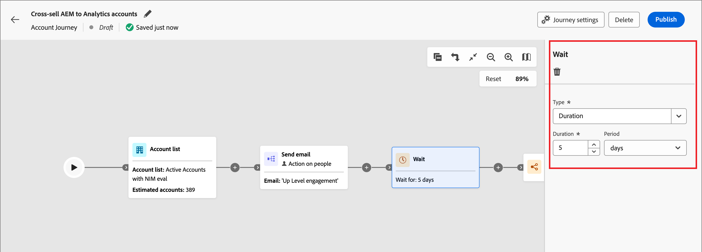

# Vänta noder

Använd en _Wait_-nod om du vill pausa reseförloppet under en viss tid innan du går vidare till nästa steg.

Du kan definiera väntetiden på två sätt:

* En relativ varaktighet (antal minuter, timmar, dagar, veckor eller månader)
* Ett specifikt datum när du vill gå vidare till nästa nod i resan

_Så här definierar du en väntenod för din kontoresa:_

1. Navigera till reseeditorn.

1. Klicka på plusikonen ( **+** ) på en bana och välj **[!UICONTROL Wait]**.

   {width="400"}

1. I nodegenskaperna till höger anger du **[!UICONTROL Type]** tid att vänta innan resan fortsätter till nästa nod i sökvägen.

   {width="700" zoomable="yes"}
