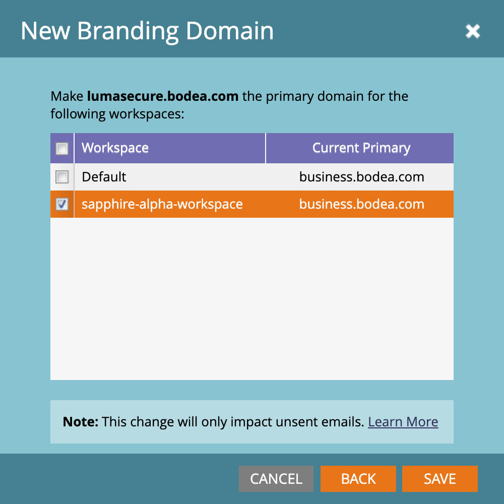

# Konfigurera profileringsdomäner

En varumärkesdomän i Marketo Engage är en anpassad underdomän (till exempel `links.yourcompany.com`) som används för att skriva om länkar och spåra e-postklick och se till att de speglar varumärket i stället för en allmän domän. Varje varumärkesdomän fungerar som en klickspårningsdomän för att förbättra leveransen och förtroendet genom att matcha e-post- och landningssidlänkar med din domän.

* Den ersätter generiska länkar med din egen profilering i e-posthyperlänkar.
* När en lead på ett konto klickar på en länk dirigeras den om via den här anpassade domänen för att tillåta prestandaspårning samtidigt som den verkar berättigad för e-postfilter.
* Om du har flera varumärken kan du konfigurera ytterligare varumärken för att stödja olika affärsenheter eller varumärken.

>[!BEGINSHADEBOX]

**Unika CNAME:er för spårning av länkar**

Spårningslänkar för e-post måste vara nya och unika för den bifogade Marketo Engage-instansen. Om du har befintliga CNAME-filer för spårning av länkar pekar på en befintlig (produktion) Marketo Engage-instans, kan de inte återanvändas _as-is_.

Du kan dela domänmärkning med retursökvägar mellan din Marketo Engage-instans och den bifogade instansen, men detta är en serverdelsändring. Öppna en supportanmälan och ange ditt Marketo Engage-prefix (Munchkin-ID) och ditt nya Journey Optimizer B2B edition-prefix (Munchkin-ID) för att begära delad domänmärkning med retursökvägar.

>[!ENDSHADEBOX]

>[!PREREQUISITES]
>
>Innan du redigerar eller lägger till en domän i användargränssnittet måste du ha en [mappad CNAME till en Marketo Engage-domän som tillhandahålls av Adobe](https://experienceleague.adobe.com/sv/docs/marketo/using/getting-started/initial-setup/setup-steps#customize-your-landing-page-urls-with-a-cname){target="_blank"}.
>
>När du lägger till en domän söker systemet efter befintliga SSL:er, som kan ha skapats manuellt tidigare. Om den här valideringen inträffar skapar du din domän utan att välja SSL-skapande och ansluter dem sedan som en separat procedur.

## Få åtkomst till varumärkesdomäner i Marketo Engage

1. Gå till området **[!UICONTROL Admin]** i din Marketo Engage-instans och välj **[!UICONTROL Email]**.

1. Bläddra ned till panelen **[!UICONTROL Branding Domains]**.

   {width="700" zoomable="yes"}

   I listan visas Marketo Engage-instansens standarddomän.

## Redigera din standardvarumärkesdomän

Det första steget när du arbetar med varumärkesdomäner är att redigera standardprofileringsdomänen som definieras i din Marketo Engage-instans.

>[!NOTE]
>
>Du kan inte definiera ytterligare en varumärkesdomän förrän du har redigerat den allmänna standarddomänen.

1. Markera den generiska domänen på panelen _[!UICONTROL Branding Domains]_&#x200B;och klicka på&#x200B;**[!UICONTROL Edit]**&#x200B;överst.

   {width="500"}

1. I dialogrutan _[!UICONTROL Edit Branding Domain]_&#x200B;anger du namnet på din standarddomän i fältet **[!UICONTROL Domain]**.

   {width="400"}

1. Om flera arbetsytor har definierats för din Marketo Engage-instans klickar du på **[!UICONTROL Next]**.

   Markera de arbetsytor där du vill använda den uppdaterade primära domänen.

   {width="400"}

1. Klicka på **[!UICONTROL Save]**.

## Definiera ytterligare en domän

När du har redigerat standarddomänen kan du lägga till en annan varumärkesdomän om du vill köra flera varumärken från din Journey Optimizer B2B edition-miljö där var och en har sina egna varumärkesspårningslänkar. När du lägger till en domän har du följande alternativ:

>* _Gör primär domän_: Gör detta till den primära domänen för arbetsytan. När du väljer det här alternativet anges alla befintliga e-postmeddelanden som inte skickats till den primära standarddomänen och alla nya e-postmeddelanden används automatiskt som standard för den här primära domänen. Marknadsförarna kan vid behov välja en alternativ varumärkesdomän.
>
>* _Generera SSL-certifikat_: Skapa ett SSL-lager (Secure Sockets Layer) när du skapar domänen. Den första spårningsdomänen initierar en engångsinställning av infrastrukturen som kan ta några timmar. Systemet skickar ett meddelande när det är klart.

_Lägga till domänen :_

1. Klicka **[!UICONTROL Add]** överst på panelen _[!UICONTROL Branding Domains]_.

   {width="500"}

1. I dialogrutan _[!UICONTROL New Branding Domain]_&#x200B;anger du namnet på varumärkesdomänen i fältet **[!UICONTROL Domain]**.

1. (Valfritt) Markera kryssrutan **[!UICONTROL Generate SSL Certificate]** om du vill generera en SSL automatiskt för domänen.

   {width="400"}

   Om det behövs och är tillgängligt kan du även markera kryssrutan _Gör primär domän_ .

   >[!NOTE]
   >
   >**_Anpassade SSL:er_**: Om du behöver en anpassad SSL:er kan du skicka en [supportanmälan](https://nation.marketo.com/t5/support/ct-p/Support){target="_blank"}. Använd inte kryssrutan för SSL-skapande.

1. Om flera arbetsytor har definierats för din Marketo Engage-instans klickar du på **[!UICONTROL Next]**.

   Välj vid behov var och en av arbetsytorna där du vill använda den nya domänen som primär domän.

   {width="400"}

1. Klicka på **[!UICONTROL Save]**.

## Redigera SSL:er för befintliga profileringsdomäner

Följ de här stegen för att aktivera SSL för dina befintliga domäner.

1. Välj **[!UICONTROL Email]** i området _[!UICONTROL Admin]_.

1. Markera domänraden på panelen _[!UICONTROL Branding Domains]_&#x200B;och klicka på&#x200B;**[!UICONTROL Add SSL]**.

   {width="500"}

1. Klicka på **[!UICONTROL Confirm]** i dialogrutan.

   {width="400"}

## Felmeddelanden

| Fel | Information |
| ----- | ------- |
| `Domain already exists.` | Det finns redan en domän med samma namn. |
| `Domain is not mapped to the default domain.` | Den anpassade domänen är inte korrekt mappad till standarddomänen. Kontrollera inställningarna för domänmappning och se till att DNS-konfigurationen pekar på rätt standarddomän. |
| `SSL certificates could not be issued due to unsupported CAA records. Request your IT to update your CAA records.` | CAA-posterna är inte uppdaterade. För dem som använder Adobe-hanterade SSL-certifikat måste CAA-poster uppdateras till certifikat som rekommenderas av leverantören. |
| `SSL certificate has already been issued.` | Det finns redan ett SSL-certifikat för den här anpassade domänen. Ingen ytterligare åtgärd krävs såvida inte certifikatet har upphört att gälla eller behöver utfärdas på nytt. |
| `The default domain was not found. Please contact Support for assistance.` | Det uppstod ett problem när standarddomänen skulle hittas. Kontakta Adobe support för att utlösa en utredning. |
| `Unexpected error encountered while creating a domain. Please contact Support for assistance.` | Ett oväntat fel uppstod. Samla loggar och felinformation och eskalera sedan problemet till Adobe support. |

## Ta bort en varumärkesdomän

>[!NOTE]
>
>Om du vill ta bort den primära varumärkesdomänen (i en eller flera arbetsytor) måste du först välja en annan varumärkesdomän som primär för varje arbetsyta.
>
>SSL-certifikatet tas inte bort när domänen **_tas bort._** Skyddsplanen förhindrar användarfel som gör att en webbplats saknar SSL-certifikat. Kontakta Adobe support om du vill ta bort SSL-certifikaten.

Markera domänen på panelen _[!UICONTROL Branding Domains]_&#x200B;och klicka på&#x200B;**[!UICONTROL Delete]**&#x200B;överst.
