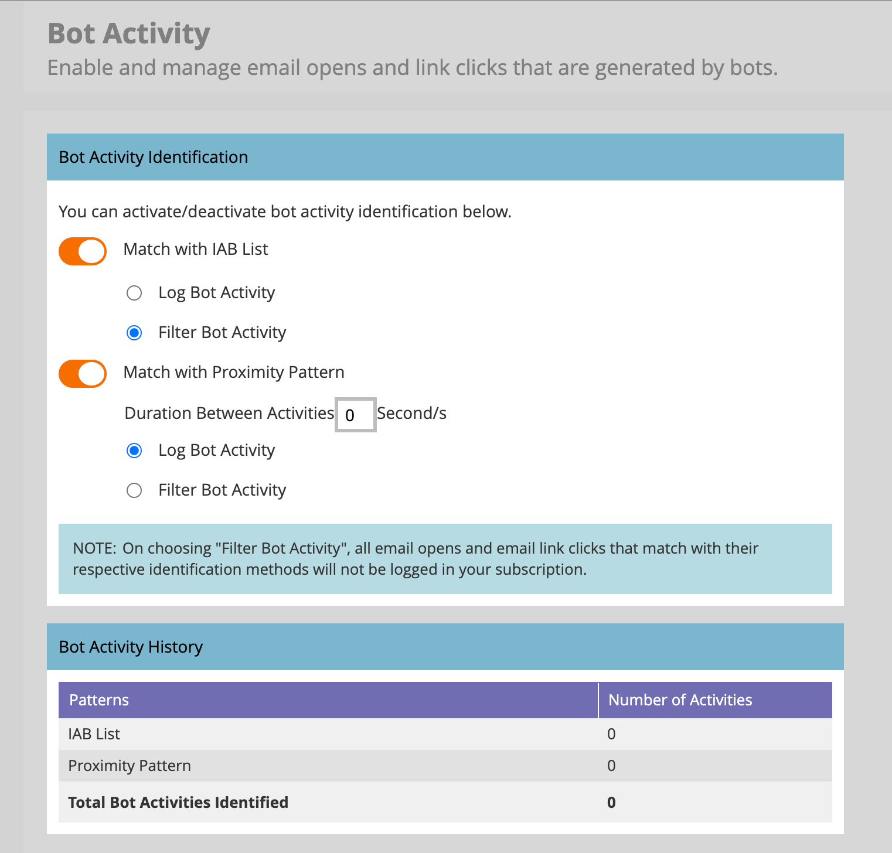

# E-postinställningar

Ange följande e-postalternativ för att stödja e-postinfrastrukturen som tillhandahålls av den bifogade Marketo Egage-instansen. En Marketo Engage-produktadministratör kan konfigurera de här inställningarna genom att gå till **[!UICONTROL Admin]**-området i Marketo Engage-instansen och välja **[!UICONTROL Email]**.

## E-postinställningar

Om du vill ange standardvärden för e-post för den bifogade Marketo Engage-instansen ändrar du de konfigurerade värdena så att de återspeglar hur din marknadsföringsorganisation använder dem.

### Från e-post och etikett

Ändra värdena för Från-e-post och etikett så att nya e-postmeddelanden automatiskt fylls med dessa standardvärden.

>[!NOTE]
>
>Ändringen gäller endast för e-postmeddelanden som du skapar och inte för andra användare av Marketo Engage eller Journey Optimizer B2B edition.

1. Gå till området **[!UICONTROL Admin]** i den bifogade Marketo Engage-instansen och välj **[!UICONTROL Email]**.

1. På panelen _[!UICONTROL Settings]_&#x200B;anger du de standardvärden som du vill använda för **[!UICONTROL From Email]**&#x200B;och **[!UICONTROL From Label]**.

   {width="500"}

1. Klicka på **[!UICONTROL Save Changes]**.

### Avbeställ utskick

För icke-operativa e-postmeddelanden om marknadsföring läggs text och länkar för avanmälan till längst ned. Som produktadministratör bör du konfigurera standardinställningen för HTML och text som fylls i när en marknadsförare inte markerar e-postmeddelandet som fungerande.

1. Gå till området **[!UICONTROL Admin]** i den bifogade Marketo Engage-instansen och välj **[!UICONTROL Email]**.

1. På panelen _[!UICONTROL Settings]_&#x200B;anger du de standardvärden som du vill använda för **[!UICONTROL Unsubscribe HTML]**&#x200B;och **[!UICONTROL Unsubscribe Text]**.

   >[!TIP]
   >
   >Marknadsförarna kan ändra positionen för det HTML som avbeställer prenumerationen i sina e-postmeddelanden med hjälp av systemtokens.

   {width="500"}

   >[!CAUTION]
   >
   >Följande variabler är viktiga. **Ta inte bort**.
   >
   >* `%mkt_opt_out_prefix%`
   >* `mkt_unsubscribe=1&mkt_tok=##MKT_TOK##`

1. Klicka på **[!UICONTROL Save Changes]**.

Om du någon gång behöver återställa till standardsysteminnehållet kopierar och klistrar du in följande:

+++ Avsluta systemets standardtext

```
<p><font face="Verdana" size="1">If you no longer wish to receive these emails, click on the following link: <a href="%mkt_opt_out_prefix%UnsubscribePage.html?mkt_unsubscribe=1&mkt_tok=##MKT_TOK##">Unsubscribe</a><br/></font></p>` [!UICONTROL Unsubscribe Text]:
%mkt_opt_out_prefix%UnsubscribePage.html?mkt_unsubscribe=1&mkt_tok=##MKT_TOK##
```

+++

### Visa som webbsida

E-postinnehåll har begränsade visningsmöjligheter (begränsad CSS och inga JavaScript eller formulär). Marknadsförarna kan använda alternativet _Visa som webbsida_ för att tillämpa en cookie för e-postmottagaren med hjälp av Marketo Munchkin. Som produktadministratör bör du konfigurera standardinställningen för HTML och text som fylls i när en marknadsförare väljer det här alternativet.

1. Gå till området **[!UICONTROL Admin]** i den bifogade Marketo Engage-instansen och välj **[!UICONTROL Email]**.

1. Ändra innehållet i fälten **[!UICONTROL View as Web Page HTML]** och **[!UICONTROL View as Web Page Text]** på panelen _[!UICONTROL Settings]_&#x200B;så att de återspeglar din ton och ditt meddelande.

   {width="500"}

   >[!CAUTION]
   >
   >Följande variabler är viktiga. **Ta inte bort**.
   >
   >`%mkt_webview_url%?mkt_tok=##MKT_TOK##`
   >
   >Den andra delen `##MKT_TOK##` är den personens Munchkin-cookie. Det ser till att cookies används korrekt när e-postmottagaren klickar på länken.
   >
   >Undvik följande:
   >
   >* Lägga till ytterligare URL:er i någon av HTML-rutorna
   >* Placera HTML i textversionen

1. Klicka på **[!UICONTROL Save Changes]**.

Om du någon gång behöver återställa till standardsysteminnehållet kopierar och klistrar du in följande:

+++ Systemets standardwebbsida HTML

```
<div style="text-align: center"><font face="Verdana" size="1">To view this email as a web page, <a href="%mkt_webview_url%?mkt_tok=##MKT_TOK##">click here</a></font></div>
```

+++

+++ Systemets standardtext för webbsidor

```
To view this email as a web page, go to the following address:
`%mkt_webview_url%?mkt_tok=##MKT_TOK##`
```

+++

## Begränsningar för hämtning av anpassade objekt

Om du använder [!DNL Velocity Script] för att visa anpassade objektdata i e-postmeddelanden justerar du den överordnade gränsen för hämtning av anpassade objekt. Som standard ger begränsningen åtkomst till 10 överordnade anpassade objekt från Snabb skriptning. Du kan vid behov öka den här gränsen.

[[!DNL Apache Velocity]](https://velocity.apache.org/) är ett språk som bygger på [!DNL Java] och som är utformat för att malla och skripta HTML-innehåll. Marketo Engage e-postinfrastruktur har stöd för att användas i samband med e-postmeddelanden via skripttokens, som ger åtkomst till data som lagras i anpassade objekt.

Du kan referera till överordnade och underordnade anpassade objekt som är direkt kopplade till leadet, eller kontakten, men inte till anpassade objekt på tredje nivån. För varje anpassat objekt är de 10 senast uppdaterade posterna per person/kontakt tillgängliga vid körning och ordnas från den senaste uppdateringen (vid `0`) till den äldsta uppdateringen (vid `9`).

_Ändra gränsen :_

1. Gå till området **[!UICONTROL Admin]** i den bifogade Marketo Engage-instansen och välj **[!UICONTROL Email]**.

1. Bläddra till panelen _[!UICONTROL Custom Object Retrieval Limits]_&#x200B;och ange ett nytt värde i **[!UICONTROL Parent Retrieval Limit]**&#x200B;fält.

   {width="500"}

   Värden från 10 till 100 stöds. _[!UICONTROL Child Retrieval Limit]_&#x200B;anges automatiskt genom att dividera 1000 med den överordnade gränsen. Om du till exempel anger den överordnade gränsen till 50 beräknas den underordnade gränsen till 20 (1 000?? 50 = 20).

1. Klicka på **[!UICONTROL Save Changes]**.

## Anpassade rubrikalternativ

Ändra _[!UICONTROL Custom Header Options]_&#x200B;för e-post om du vill konfigurera länkrubriker för e-postspårning. Aktivera dessa alternativ för att implementera säkra spårningslänkar med HTTPS med Strict Transport.

1. Gå till området **[!UICONTROL Admin]** i den bifogade Marketo Engage-instansen och välj **[!UICONTROL Email]**.

1. Bläddra till panelen _[!UICONTROL Custom Header Options]_&#x200B;och ändra inställningen enligt spårningslänkens principer:

   {width="500"}

   * **[!UICONTROL Strict Transport Security]** - Ange det här alternativet till Aktiverat för att garantera att spårningslänkar alltid överförs via HTTPS (ska endast anges för prenumerationer med spårningslänkar som skyddas av SSL).
   * **[!UICONTROL Max-age]** - Det här fältet har stöd för det obligatoriska direktivet för att ange den tid, i sekunder, som webbläsaren ska komma ihåg att bara komma åt domänen via HTTPS.
   * **[!UICONTROL IncludeSubDomains]** - Använd det här alternativet om du vill inkludera direktivet som tillämpar HSTS-principen på alla underdomäner till värden.

   >[!IMPORTANT]
   >
   >Granska de här inställningarna tillsammans med IT-teamet för att se till att de är i linje med organisationens policy. Felaktiga inställningar kan hindra vissa besökare från att få åtkomst till dina e-postlänkar.

1. Klicka på **[!UICONTROL Save Changes]**.

## Filtrera e-postrobotaktivitet {#filter-email-bots}

Rotera-aktiviteter via e-post, som även kallas icke-mänsklig interaktion (NHI), kan blåsa upp dina e-postöppningar i _öppningar_ och _klickningar_, vilket förvränger dina interaktionsvärden och utlöser händelsebaserad reseprogression. Använd filtrering av e-postrobotar för att bevara integriteten hos klickengagemangsmått och insikter. Det finns två metoder för att identifiera misstänkt robotaktivitet:

* _&#x200B;**[!UICONTROL Match with IAB Bot list]**&#x200B;_- Aktiviteter som matchar något i [Interactive Advertising Bureau bot list](https://www.iab.com/guidelines/iab-abc-international-spiders-bots-list/){target="_blank"} (User Agent/IP address) markeras som bots.
* _&#x200B;**[!UICONTROL Match with Proximity Pattern]**&#x200B;_- Två eller flera aktiviteter som inträffar samtidigt (under en sekund) identifieras som bottar. Attribut som beaktas vid jämförelse är:
   * Lead-ID (ska vara samma)
   * E-postresurs (ska vara samma)
   * Klicka eller mejla

För e-postlänksklickning och e-postöppningsaktivitet fylls attributen i med följande värden:

* Aktiviteter som identifieras som bottar - _punktaktivitet_ = `true` och _punktaktivitetsmönster_ = identifierat mönster/metod
* Aktiviteter som inte identifieras som &quot;bots&quot; - _punktaktivitet_ = `false` och _punktaktivitetsmönster_ = `n/a`

### Ange filter

1. Gå till området **[!UICONTROL Admin]** i den bifogade Marketo Engage-instansen och välj **[!UICONTROL Email]**.

1. Välj fliken **[!UICONTROL Bot Activity]**.

   {width="700" zoomable="yes"}

   På panelen Identifiering av punktaktivitet visas två reglage som du kan använda för att identifiera båda aktiviteterna.

1. Aktivera det ena eller båda genom att växla skjutreglaget.

   Välj _[!UICONTROL Log Bot Activity]_&#x200B;eller&#x200B;_[!UICONTROL Filter Bot Activity]_ för varje metod som du aktiverar.

   >[!IMPORTANT]
   >
   >Om du väljer [!UICONTROL Filter Bot Activity] kan du se att ett e-postmeddelande öppnas och att du klickar på eftersom falska aktiviteter tas bort.

   {width="500"}

   För _[!UICONTROL Match with Proximity Pattern]_&#x200B;kan du också ange antalet sekunder för **[!UICONTROL Duration Between Activities]**(standardvärdet är `0`, maxvärdet är `3`).

   >[!NOTE]
   >
   >Med _Varaktighet mellan aktiviteter_ inställd på `0` sekunder identifierar Marketo Engage e-postaktiviteter som inträffar exakt samma sekund. Om flera e-postaktiviteter inträffar inom det angivna antalet sekunder identifieras de som en Båda-aktivitet.

   Om du vill inaktivera någon av filtreringsmetoderna växlar du skjutreglaget åt vänster. Om du gör det återställs inte data.

### IP BLOCKERINGSLISTA

Adobe har identifierat en lista över IP-adresser som ansvarar för att generera miljontals falska åtaganden, eftersom ett sådant engagemang som tas emot från någon av följande IP-adresser automatiskt filtreras ut och inte läggs till i din Marketo Engage-instans. Den här filtreringen kan leda till att e-postöppningar, klick och andra relaterade aktiviteter minskar. Denna lista kan uppdateras regelbundet.

+++ Blockerade IP-adresser

* 40.94.34.52
* 40.94.34.86
* 52.34.76.65
* 54.70.53.60
* 54.71.187.124
* 60.28.2.248
* 64.235.150.252
* 64.235.153.10
* 64.235.153.2
* 64.235.154.105
* 64.235.154.109
* 64.235.154.140
* 64.74.215.1
* 64.74.215.100
* 64.74.215.138
* 64.74.215.139
* 64.74.215.142
* 64.74.215.146
* 64.74.215.150
* 64.74.215.154
* 64.74.215.158
* 64.74.215.162
* 64.74.215.164
* 64.74.215.166
* 64.74.215.170
* 64.74.215.174
* 64.74.215.176
* 64.74.215.178
* 64.74.215.51
* 64.74.215.56
* 64.74.215.58
* 64.74.215.59
* 64.74.215.86
* 64.74.215.98
* 65.154.226.101
* 66.249.91.149
* 70.42.131.106
* 74.125.217.116
* 74.217.90.250
* 104.129.41.4
* 104.47.55.126
* 104.47.58.126
* 104.47.70.126
* 104.47.73.126
* 104.47.73.254
* 104.47.74.126
* 128.220.160.1
* 155.70.39.101
* 162.129.251.14
* 162.129.251.42
* 208.52.157.204

>[!NOTE]
>
>Alla IP-adresser analyseras och granskas noggrant innan de tas med i listan, vilket säkerställer att endast de mest kritiska och skadliga IP-adresserna blockeras.

+++

